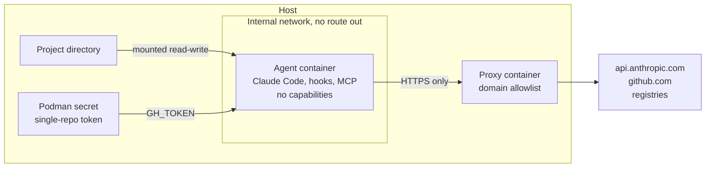

# Sandboxed Coding Agent: Developer Setup Guide

Last updated 2026-09-18

## Overview

This guide sets up Claude Code so that the agent, its hooks and its MCP servers all run inside a rootless Podman container that can see one project directory, reach an allowlist of domains, and hold one GitHub token that works on one repository. It takes about 30 minutes on Ubuntu 24.04.

| Stage | You run | You get |
| --- | --- | --- |
| 1. Podman | `01-setup-podman.sh` | Rootless Podman, GPU access through CDI, the agent image, the egress proxy, two no-route-out networks |
| 2. GitHub | `02-github-single-repo.sh OWNER/REPO` | A fine-grained token for that repo only: read, commit, push, comment. Stored as a Podman secret |
| 3. Claude Code settings | Baked into the image, plus `03-claude-settings.sh` for the host | Project hooks and MCP servers blocked, merge and force-push gated, host secrets unreadable |
| Daily use | `agent-run.sh [--gpu] [--perf]` | Claude Code on the current directory, inside the sandbox |
| New untrusted repo | `inspect-repo.sh URL`, then `agent-run.sh --untrusted` | A review of everything the repo would auto-run, then a session with no token, no GPU and model-API-only network |



The agent container has no route to the internet. Its only way out is the proxy, which allows HTTPS to listed domains and refuses everything else.

### What this does not give you

- It is a shared-kernel sandbox. A Linux kernel or NVIDIA driver bug can still reach the host. Appendix A covers when to use a VM instead.
- The project directory is writable, so the agent can change any file in it, including build scripts you later run on the host.
- `github.com` is on the allowlist, so data can be sent there. The single-repo token limits where.

### What was tested

The scripts live in [`scripts/`](../scripts/). On the authoring machine (Ubuntu 24.04, Docker 27.2, no Podman installed):

| Piece | Status |
| --- | --- |
| All scripts | Pass `bash -n`. Not run end to end |
| Agent image | Builds and runs under Docker. Claude Code 2.1.277 installs, `claude doctor` reports no settings problems, the git credential helper returns the token |
| Proxy allowlist | Tested under Docker: allowed domains connect, `example.com` gets 403, plain HTTP gets 403, direct egress has no route |
| `03-claude-settings.sh` | Merge tested against a sample settings file |
| `inspect-repo.sh` | Tested against a fabricated hostile repo (flagged all 8 planted items) and a clean repo (0 flags, exits cleanly) |
| `01-setup-podman.sh`, `agent-run.sh`, `02-github-single-repo.sh` | **Not run.** Podman was not available, and the GitHub script needs a real token. The launcher was dry-run against a stub podman to check the commands it builds for trusted, GPU, perf and untrusted modes. Expect to fix small things on first use |

## Before you start

Fix these host problems first, because each one lets code running as you skip the sandbox entirely. `01-setup-podman.sh` checks for all of them and prints a warning.

| Check | Command | Needs to be | Fix |
| --- | --- | --- | --- |
| Not in the `docker` group | `id -nG` | `docker` absent | `sudo gpasswd -d $USER docker`, then log out and in |
| Not in the `lxd` group | `id -nG` | `lxd` absent | `sudo gpasswd -d $USER lxd` |
| runc | `runc --version` | 1.2.8, 1.3.3 or later | Update Docker Engine and containerd |
| NVIDIA Container Toolkit (GPU users) | `nvidia-ctk --version` | 1.17.8 or later | Update from NVIDIA's apt repository |
| NVIDIA driver (GPU users) | `nvidia-smi` | 580.95.05 or later | Update the driver |
| Claude Code | `claude --version` | Current release | Leave auto-update on |

**Why.** Membership of the `docker` or `lxd` group is root on the host: `docker run -v /:/host` needs no password. Older runc and NVIDIA toolkit versions have published container escapes to host root. Appendix A has the CVE details.

You also need `git`, `curl`, `jq`, and optionally the `gh` CLI logged in as yourself for the branch-protection step in Stage 2.

## Stage 1: Podman

**Why.** Claude Code's built-in sandbox covers Bash commands only; hooks and MCP servers run on the host as you, and it cannot expose a GPU. Putting the whole agent in a container covers all three. Rootless Podman has no root daemon and no root-equivalent group, so a container-runtime bug lands an attacker in your unprivileged account, not in root. Details in Appendix A.

**Run it.**

```bash
cd scripts
./01-setup-podman.sh
# CUDA toolkit inside the image (nvcc, headers): pick a CUDA base instead of plain Ubuntu
BASE_IMAGE=docker.io/nvidia/cuda:12.6.3-devel-ubuntu24.04 ./01-setup-podman.sh
```

**What it sets up.**

| Piece | Purpose |
| --- | --- |
| `podman`, `uidmap`, `passt`, `slirp4netns`, `crun` | Rootless containers and their networking. `crun` is the runtime, so the runc bugs do not apply |
| `/etc/subuid`, `/etc/subgid` entries | The id ranges user namespaces need |
| `/etc/cdi/nvidia.yaml` | Lets a container request the GPU with `--device nvidia.com/gpu=all`. Regenerate after each driver update |
| `~/.config/agent-sandbox/seccomp-perf.json` | Podman's default seccomp profile plus `perf_event_open`, used only with `--perf` |
| `~/.config/agent-sandbox/allowed-domains*.txt` | The egress allowlists. Edit these, then restart the proxy container |
| `localhost/agent-claude` image | Ubuntu, Claude Code, git, gh, Python, build tools, non-root user `agent`, managed settings, git config |
| `localhost/agent-proxy` image | Squid, HTTPS CONNECT to allowlisted domains only |
| `agent-internal`, `agent-untrusted` networks | Created with `--internal`: no route to the outside |

**The script:** [`scripts/01-setup-podman.sh`](../scripts/01-setup-podman.sh), commented step by step. The container build files it uses are in [`scripts/container/`](../scripts/container/).

**Check it worked.**

```bash
podman run --rm --device nvidia.com/gpu=all docker.io/library/ubuntu:24.04 nvidia-smi -L   # GPU users
podman images | grep agent-          # two images
podman network ls | grep agent-      # two networks
```

## Stage 2: GitHub for a single repository

**Why.** A prompt-injected agent uses whatever credential it holds. In the 2025 GitHub MCP exploit, a malicious issue in a public repo made an agent copy private-repo data into a public pull request, and the only precondition was one token that covered both. A token that works on one repository has nothing else to leak. Details in Appendix B.

**Permissions the token gets.**

| Fine-grained permission | Level | Lets the agent |
| --- | --- | --- |
| Contents | Read and write | Clone, fetch, commit, push |
| Issues | Read and write | Read issues, add comments |
| Pull requests | Read and write | Open pull requests, add comments and review comments |
| Metadata | Read-only | Added by GitHub automatically |

Left off on purpose: Workflows (so it cannot edit `.github/workflows`), Administration, Secrets, Webhooks, Actions, and every other repository.

**Run it.**

```bash
./02-github-single-repo.sh myorg/myrepo --protect-default-branch
# optional: prove another private repo of yours is invisible to the token
./02-github-single-repo.sh myorg/myrepo --canary myorg/some-other-private-repo
```

GitHub has no API for creating fine-grained tokens. The script opens the creation page with the name, owner, expiry and permissions [pre-filled from URL parameters](https://docs.github.com/en/authentication/keeping-your-account-and-data-secure/managing-your-personal-access-tokens). You pick the repository by hand, generate, and paste the token back. The script then checks the token and stores it as a Podman secret named `gh-OWNER-REPO`, which `agent-run.sh` attaches only when you start it inside a checkout of that repo.

**The script:** [`scripts/02-github-single-repo.sh`](../scripts/02-github-single-repo.sh), commented step by step. The part that fixes the permissions is the pre-filled URL:

```bash
URL="https://github.com/settings/personal-access-tokens/new"
URL+="?name=$NAME"
URL+="&description=Coding+agent%3A+single+repo+$OWNER%2F$REPO"
URL+="&target_name=$OWNER"            # personal account or organization that owns the repo
URL+="&expires_in=$EXPIRES"           # short-lived on purpose; re-run this script to rotate
URL+="&contents=write"                # commit and push
URL+="&issues=write"                  # comment on issues
URL+="&pull_requests=write"           # open PRs, comment on PRs
```

After you paste the token back, the script refuses classic (`ghp_`) tokens, confirms the target repo is readable, prints the expiry, fails if any other private repository is visible to the token, stores it with `podman secret create`, and with `--protect-default-branch` adds a ruleset using your own `gh` login.

**Inside the container** the token arrives as `GH_TOKEN`. The image's `/etc/gitconfig` has a credential helper that hands it to git for `https://github.com` only, and rewrites `git@github.com:` remotes to HTTPS because the container has no SSH keys and no route except the proxy. The `gh` CLI reads `GH_TOKEN` by itself.

**Not yet run against GitHub.** The URL parameters and permission names come from GitHub's docs; the ruleset payload and the private-repo listing check are untested. Try the script on a scratch repository first.

## Stage 3: Claude Code settings

**Why.** A repository can ship its own `.claude/settings.json`, and project settings outrank your user settings. A user-level `disableAllHooks: true` can be switched back off by the repo. Managed settings are the one level a repository cannot override, so the rules that matter go there. Details in Appendix C.

There are two places to configure, and they do different jobs.

### Inside the container: managed settings (already done by Stage 1)

The image carries `/etc/claude-code/managed-settings.json`. Nothing to run; edit [`scripts/container/managed-settings.json`](../scripts/container/managed-settings.json) and rebuild to change it.

```json
{
  "allowManagedHooksOnly": true,
  "allowManagedMcpServersOnly": true,
  "allowedMcpServers": [],
  "enableAllProjectMcpServers": false,
  "permissions": {
    "deny": [
      "Bash(gh pr merge *)",
      "Bash(gh repo delete *)",
      "Bash(gh secret *)",
      "Bash(gh auth token*)"
    ],
    "ask": [
      "Bash(git push --force*)",
      "Bash(git push -f *)",
      "Bash(git push * --force*)"
    ]
  }
}
```

| Key | Effect |
| --- | --- |
| `allowManagedHooksOnly` | Blocks hooks from user, project, local and plugin settings. A cloned repo's hooks never run |
| `allowManagedMcpServersOnly` with an empty `allowedMcpServers` | Only MCP servers named in this file may load. The list is empty, so a repo's `.mcp.json` is ignored. Add servers you vet by name |
| `enableAllProjectMcpServers: false` | No blanket approval of project MCP servers |
| `permissions.deny` | The agent opens pull requests and you merge them. Deny rules win over any allow rule from any scope |
| `permissions.ask` | Force-pushes always prompt |

Bash rules match the command text, so they are a guard rail, not a boundary. The boundary is the token's permissions and the branch ruleset from Stage 2.

The Claude Code Bash sandbox is left off inside the container. It needs a weaker nested mode there, and the container plus proxy already do its job.

### On the host: for the times you run `claude` outside the container

```bash
./03-claude-settings.sh            # merge hardening into ~/.claude/settings.json, backup kept
./03-claude-settings.sh --managed  # also install /etc/claude-code/managed-settings.json (sudo)
```

The merge keeps your existing settings, unions lists, and sets:

| Setting | Effect |
| --- | --- |
| `sandbox.enabled`, `failIfUnavailable: true` | Bash sandbox on, and a hard failure instead of silently running unsandboxed when bubblewrap is missing |
| `sandbox.allowUnsandboxedCommands: false` | Removes the retry-outside-the-sandbox escape hatch |
| `sandbox.network.strictAllowlist: true` | Unlisted domains are denied, not prompted |
| `sandbox.credentials` | `~/.ssh`, `~/.aws/credentials`, `~/.config/gh`, `~/.docker/config.json` and Podman's secret store are unreadable to sandboxed commands; `GITHUB_TOKEN`, `GH_TOKEN`, `NPM_TOKEN` are removed from their environment |
| `permissions.deny` Read rules | The same paths, for Claude's Read tool, which the sandbox does not cover |
| `permissions.disableBypassPermissionsMode` | No bypass mode on the host. Use the container for that |

`--managed` installs a host managed-settings file with `allowManagedHooksOnly`. It also blocks your own user-level hooks, so move any you rely on into that file.

**Check it worked.** In a session run `/status` and look for `Enterprise managed settings (file)` on the `Setting sources` line. Run `claude doctor` to see any setting it rejected. Run `/sandbox` on the host to confirm the mode.

## Daily use

Start the agent from the project directory with `agent-run.sh`; that directory is the only host path the container can see. Put the scripts directory on your `PATH` first.

```bash
cd ~/src/myrepo
agent-run.sh --shell            # first time only: run `claude`, then /login, then exit
agent-run.sh                    # normal session
agent-run.sh --gpu              # CUDA work
agent-run.sh --gpu --perf       # CUDA plus hardware perf counters
agent-run.sh --gvisor --gpu     # less-trusted repo, if gVisor is installed (no perf counters)
agent-run.sh -- --resume        # everything after -- goes to claude
```

| Flag | Adds | Cost |
| --- | --- | --- |
| none | Project mounted read-write, proxy-only network, GitHub token if one exists for this repo's origin |  |
| `--gpu` | `--device nvidia.com/gpu=all` | Code in the container can send raw ioctls to the host NVIDIA driver. Use only when the task needs CUDA |
| `--perf` | The seccomp profile that allows `perf_event_open` | That syscall can leak some host information, which is why it is blocked by default |
| `--gvisor` | `--runtime=runsc` | No perf counters. GeForce cards are unofficial. Needs gVisor installed and registered with Podman |
| `--untrusted` | See the next section | No push, no GPU, no registries |
| `--shell` | bash instead of claude |  |

**Every run gets:** no Linux capabilities, `no-new-privileges`, a pids limit of 2048, 16 GB memory limit, a tmpfs `/tmp`, your host user mapped to the container's `agent` user so file ownership in the project stays yours, and Claude's login kept in the `agent-claude-home` volume.

**Housekeeping.**

```bash
$EDITOR ~/.config/agent-sandbox/allowed-domains.txt && podman rm -f agent-proxy   # change the allowlist
podman exec agent-proxy tail -f /var/log/squid/access.log                         # see what was allowed or denied
./01-setup-podman.sh                                                             # rebuild to update Claude Code
podman volume rm agent-claude-home                                               # reset Claude state and login
```

A `TCP_DENIED/403` line in the proxy log is the quickest way to find the domain a tool needs. Add the narrowest name that works.

## Opening a new untrusted repository

Never open an unreviewed repo with an agent or an editor on the host. Clone it without running anything, read what it would auto-run, then work on it only in `--untrusted` mode until you have reviewed it.

**Why.** A cloned repo can carry hooks, MCP server commands, environment overrides, editor tasks that run on folder open, and package install scripts. These have caused code execution and API-key theft in Claude Code (CVE-2025-59536, CVE-2026-21852, both fixed) and still run silently in Cursor, which ships with Workspace Trust off. Details in Appendix C.

### Procedure

1. **Clone and inspect, from the host, with nothing executed.**

```bash
cd ~/src
inspect-repo.sh https://github.com/someone/project.git    # clones into ./untrusted/project
```

The clone runs with hooks disabled, no submodules and no LFS smudge. The script prints and flags:

- `.claude/settings.json`, `.claude/settings.local.json`, `.mcp.json`: hooks, `env` overrides such as `ANTHROPIC_BASE_URL`, pre-approved MCP servers, helper commands, shipped allow rules. A committed `settings.local.json` is suspicious in itself.
- `.vscode/tasks.json` tasks with `runOn: folderOpen`, and any `.devcontainer`.
- `package.json` install-time scripts, `setup.py`, `.npmrc`, submodules.
- `curl`, `wget`, `nc`, `base64 -d`, `eval`, key paths in agent and editor config.
- Invisible Unicode in `CLAUDE.md`, `AGENTS.md`, rules files and READMEs.

2. **Read everything it flagged.** A flag is a prompt to read, not a verdict. Instruction files (`CLAUDE.md`, `AGENTS.md`) deserve a full read: they are loaded into the agent's context as if you wrote them.
3. **Start the agent in untrusted mode.**

```bash
cd ~/src/untrusted/project
agent-run.sh --shell --untrusted    # first time only: separate login for the untrusted state volume
agent-run.sh --untrusted
```

| Untrusted mode changes | Reason |
| --- | --- |
| No GitHub token attached | Nothing to push with, nothing to steal |
| `--gpu` refused | Keeps the NVIDIA driver out of reach of unknown code |
| Separate network and proxy with `allowed-domains-untrusted.txt`: Anthropic endpoints only | No GitHub, no registries, so nowhere to send data |
| Separate `agent-claude-home-untrusted` volume | Nothing the repo writes into Claude's state can affect later trusted sessions |
| `claude --setting-sources user` | The repo's `.claude/settings*.json` and `.mcp.json` are not read at all |
| Managed settings, as always | Hooks and MCP servers from any source stay blocked |

4. **Installing dependencies.** Add the one registry you need to `allowed-domains-untrusted.txt`, restart the proxy with `podman rm -f agent-proxy-untrusted`, install with scripts off (`npm ci --ignore-scripts`, `pip install --only-binary=:all:` so no setup.py runs), then remove the registry again.
5. **Do not run the repo's code on the host.** Tests, builds and `make` targets run inside the container. Anything the agent changed in the project directory, including Makefiles and `package.json` scripts, runs with your full privileges if you run it outside.
6. **Promote it when you have reviewed it.** Move the checkout out of `untrusted/`, create a token with Stage 2 if you need to push, and use plain `agent-run.sh`. If you open it in an editor, turn Workspace Trust on first: in Cursor set `security.workspace.trust.enabled: true` and `task.allowAutomaticTasks: off`.
7. **For code you consider hostile,** use a VM or a throwaway cloud machine instead. This container shares your kernel.

## Appendix A: why rootless Podman, and its limits

Rootless Podman is the strongest option that still gives CUDA on a single-GPU machine and hardware perf counters. It is not the strongest sandbox; it is the best fit for daily GPU work.

### Why not the built-in Claude Code sandbox alone

- It wraps Bash commands only. Anthropic's docs say MCP servers and command hooks ["run unconstrained on the host"](https://code.claude.com/docs/en/sandbox-environments), and recommend a container, VM or the sandbox runtime for unattended work.
- It builds a fresh `/dev` with no NVIDIA device nodes. [Issue #13108](https://github.com/anthropics/claude-code/issues/13108), open since December 2025, asks for device passthrough and has no workaround other than disabling the sandbox.
- By default it falls back to unsandboxed when dependencies are missing and lets failed commands retry outside the sandbox. Stage 3 turns both off on the host.

### Why not plain Docker

- The Docker daemon runs as root and the `docker` group is root-equivalent.
- Containers share the host kernel and are started by a privileged runtime. In November 2025 runc fixed [CVE-2025-52881](https://github.com/opencontainers/runc/security/advisories/GHSA-cgrx-mc8f-2prm) and two related bugs that let a hostile Dockerfile or container gain host root. Fixed in runc 1.2.8 and 1.3.3.
- The runc maintainers say rootless containers "entirely mitigate" that bug's privilege escalation, because an unprivileged runtime cannot write the procfs files the attack targets. That is the main reason for rootless.
- [CVE-2025-23266 "NVIDIAScape"](https://www.wiz.io/blog/nvidia-ai-vulnerability-cve-2025-23266-nvidiascape) (CVSS 9.0): a three-line Dockerfile got host root through the NVIDIA Container Toolkit's hook. Fixed in toolkit 1.17.8. It triggers when a container is created from an attacker's image, so never let the agent build or start containers on the host.

### What each launcher flag buys

| Flag in `agent-run.sh` | Stops |
| --- | --- |
| Rootless, `--userns=keep-id` | Root in the container is not root on the host. Project files keep your ownership |
| `--network agent-internal` plus the proxy | Exfiltration to arbitrary hosts and reverse shells. The agent cannot remove the rule because it is enforced in another container |
| `--cap-drop=ALL`, `no-new-privileges` | Raw sockets, mounts, ptrace of other users' processes, setuid escalation |
| Only `$PWD` mounted | Reading `~/.ssh`, cloud credentials, browser profiles, other projects |
| `--pids-limit`, `--memory` | Fork bombs and memory exhaustion |
| Podman secret as `GH_TOKEN` | The token is not on a command line, in `podman inspect`, or in a file in the project |
| `core.hooksPath=/dev/null` in the image | Git hooks the agent or a dependency wrote into `.git/hooks` |

### The GPU trade-off

- CUDA talks to the host NVIDIA kernel driver through `/dev/nvidia*`. With `--gpu`, code in the container can send raw ioctls to that driver. [Quarkslab](https://blog.quarkslab.com/nvidia_gpu_kernel_vmalloc_exploit.html) turned two such bugs into a root shell from an unprivileged process; both are fixed in driver 580.95.05. Keep the driver current and pass `--gpu` only when needed.
- The only way to remove the host driver from the attack surface is to hand the whole GPU to a VM over VFIO. Docker Sandboxes, Kata and libvirt all work that way, and all need [a GPU the host is not using](https://docs.docker.com/ai/sandboxes/configuration/gpu-passthrough/). NVIDIA's GPU-sharing modes are licensed datacenter features.
- [gVisor's nvproxy](https://gvisor.dev/docs/user_guide/gpu/) narrows the driver surface to an allow-list of ioctls and protects against general kernel bugs. It says it is "much less effective" against NVIDIA driver bugs, GeForce cards are unofficial, rootless mode with nvproxy is [broken upstream](https://github.com/google/gvisor/issues/11076), and [`perf_event_open` is unimplemented](https://gvisor.dev/docs/user_guide/compatibility/linux/amd64/).

| Need | Use |
| --- | --- |
| CUDA and perf counters, repo you trust | `agent-run.sh --gpu --perf` |
| CUDA, repo you trust less, no profiling | `agent-run.sh --gvisor --gpu` |
| Untrusted code, no GPU | `agent-run.sh --untrusted`, or a VM |
| Untrusted code that needs a GPU | A separate machine or cloud GPU instance that holds no credentials |

### Perf counters

Docker's default seccomp profile [blocks `perf_event_open`](https://docs.docker.com/engine/security/seccomp/) as a host information leak, and Podman's default derives from it. `--perf` swaps in a copy of Podman's profile with that one syscall allowed. The host also needs `kernel.perf_event_paranoid` at 2 or lower; Ubuntu's default is higher. On the authoring machine, `perf stat` inside a bubblewrap sandbox returned real hardware counters; the same through Podman with this profile is not yet tested.

### What NVIDIA's AI red team asks of any agent sandbox

[Their January 2026 guidance](https://developer.nvidia.com/blog/practical-security-guidance-for-sandboxing-agentic-workflows-and-managing-execution-risk/) lists three mandatory controls: an egress allowlist, no writes outside the workspace, and no writes to agent config, hooks or MCP config. This setup meets the first two. For the third, managed settings make repo-written hooks and MCP config inert, but the agent can still edit `CLAUDE.md` in the project. They also recommend VMs over shared-kernel sandboxes, injected short-lived secrets, and recreating sandboxes regularly.

### Known rough edges

- Tools that ignore `HTTPS_PROXY` cannot reach the network at all. That is the safe failure, but some Node and Go programs need their own proxy setting.
- On SELinux hosts add `,Z` to the project mount and `--security-opt label=disable` when using `--gpu`, as in NVIDIA's CDI example.
- On the authoring machine, Docker refused to start any program with `no-new-privileges` set. Podman with crun was not available to compare. If containers fail with `operation not permitted` at start, test without that flag to isolate it.

## Appendix B: GitHub permissions in detail

The token is the real boundary for anything the agent does on GitHub; settings and prompts are guard rails on top of it.

### The exploit this defends against

[Invariant Labs, May 2025](https://invariantlabs.ai/blog/mcp-github-vulnerability): an attacker files an issue with hidden instructions in a public repo. The user asks their agent to look at open issues. The agent reads the issue, pulls data from the user's private repos, and publishes it in a pull request on the public repo. It worked against Claude 4 Opus, so model alignment is not a defence. Invariant notes GitHub "cannot resolve this vulnerability through server-side patches". The precondition was one token spanning a public repo others can write to and the user's private repos. [Simon Willison](https://simonwillison.net/2025/Jun/16/the-lethal-trifecta/) calls the general pattern the lethal trifecta: private data, untrusted content, and a way to send data out.

### Why a fine-grained token

| Credential | Per-repo scoping | Verdict |
| --- | --- | --- |
| Classic PAT (`ghp_...`) | None. The `repo` scope reaches every repo you can access | The script refuses these |
| `gh auth login` OAuth token | None | Keep it on the host. It never enters the container |
| Fine-grained PAT (`github_pat_...`) | Selected repos, per-permission levels, expiry | Used here. [GitHub recommends them](https://docs.github.com/en/authentication/keeping-your-account-and-data-secure/managing-your-personal-access-tokens) over classic tokens |
| Deploy key | One repo, git only | Cannot comment, so not enough here |
| GitHub App or machine-user account | Own identity, short-lived tokens | Stronger. See below |

### What each permission maps to

From GitHub's [permissions reference for fine-grained tokens](https://docs.github.com/en/rest/authentication/permissions-required-for-fine-grained-personal-access-tokens):

| Action | Permission needed | In this token? |
| --- | --- | --- |
| Clone, fetch, push commits | Contents: write | Yes |
| Comment on an issue | Issues: write | Yes |
| Open a pull request, comment or review-comment on one | Pull requests: write | Yes |
| Merge a pull request | Contents: write | Yes, as a side effect |
| Edit files under `.github/workflows/` | Workflows: write | No |
| Change settings, secrets, webhooks, collaborators | Administration and others | No |
| Anything in another repository |  | No |

### What the token can still do, and the mitigations

- **Merge its own pull request, push to any branch, delete branches.** Contents: write covers all of these; GitHub has no narrower level. `--protect-default-branch` adds a ruleset that blocks force-pushes to, deletion of, and direct pushes to the default branch, so changes arrive as pull requests. The managed settings deny `gh pr merge`.
- **A solo developer cannot fully stop self-merge.** The token acts as you, and you are allowed to merge. On a team, set required approvals to 1 in the ruleset: the agent's pull requests are authored by your identity, and GitHub does not let an author approve their own pull request.
- **Exfiltrate the repo's own contents** into a comment, a branch or a pull request. Single-repo scoping accepts this risk. Do not use this setup on a repo whose contents must not leak.
- **Rulesets on private repos need a paid plan.** On a free private repo, rely on review before merging.

### Stronger: give the agent its own identity

Create a machine-user account or a GitHub App, give it write access to the one repo, and issue the token from that identity. Then required reviews are real, because the agent is not you; its commits and comments are attributable; and revoking it does not touch your own access. GitHub recommends an App for organization or long-lived use. This guide uses a personal fine-grained token because every developer can create one without an org admin.

### Fine-grained token limits to know

- They cannot write to public repos you do not own or belong to. Fork, give the token the fork, and open pull requests from it.
- One token covers one owner. Organization owners can require approval before a token works on org repos, so creation may wait on an admin.
- The script defaults to 30 days. Re-run it to rotate.

### If you use the GitHub MCP server

It is off in this setup, because managed settings allow no MCP servers. If you add it to `allowedMcpServers`, note that [its defaults](https://github.com/github/github-mcp-server/blob/main/docs/server-configuration.md) include write tools such as `merge_pull_request`, `push_files` and `delete_file`. Start it with `--read-only` or an explicit `--toolsets` list. GitHub describes its lockdown mode as "a best-effort content filter... not an authorization boundary", so keep the single-repo token underneath.

## Appendix C: Claude Code settings in detail

Claude Code reads settings from five levels, and a repository controls two of them, so anything that must hold against a hostile repo has to sit above project level.

### Precedence

| Rank | Level | File | Who controls it |
| --- | --- | --- | --- |
| 1 | Managed | `/etc/claude-code/managed-settings.json` on Linux | Whoever has root. In the container, the image |
| 2 | Command line | `claude --settings '{...}'` | You, this session |
| 3 | Project local | `.claude/settings.local.json` | The repo, if it commits one |
| 4 | Project | `.claude/settings.json` | The repo |
| 5 | User | `~/.claude/settings.json` | You |

From the [settings](https://code.claude.com/docs/en/settings) and [managed settings](https://code.claude.com/docs/en/managed-settings) docs. Permission rules are the exception that helps you: deny is evaluated before ask and allow, from every scope, so a deny in your user settings beats an allow shipped by a repo.

### What repositories have done with project settings

| Issue | Mechanism | Status |
| --- | --- | --- |
| [GHSA-ph6w-f82w-28w6](https://research.checkpoint.com/2026/rce-and-api-token-exfiltration-through-claude-code-project-files-cve-2025-59536/) | Hook commands in `.claude/settings.json` ran once the generic trust dialog was accepted; the dialog did not mention hooks | Dialog improved August 2025 |
| [CVE-2025-59536](https://github.com/advisories/GHSA-4fgq-fpq9-mr3g), CVSS 8.7 | `enableAllProjectMcpServers` plus `.mcp.json` started the repo's MCP command before the trust dialog could be read | Fixed in 1.0.111 |
| [CVE-2026-21852](https://github.com/advisories/GHSA-jh7p-qr78-84p7) | `ANTHROPIC_BASE_URL` in project settings sent the API key to the attacker's server before trust | Fixed in 2.0.65 |
| [CVE-2026-25725](https://github.com/anthropics/claude-code/security/advisories/GHSA-ff64-7w26-62rf), CVSS 7.7 | Sandboxed code created a missing `.claude/settings.json` with a `SessionStart` hook that ran on the host at next launch | Fixed in 2.1.2 |
| [Cursor Workspace Trust](https://www.oasis.security/blog/cursor-security-flaw) | `.vscode/tasks.json` with `runOn: folderOpen` runs on open, because Cursor ships with Workspace Trust off | Still the default |

All the Claude Code issues are fixed, and none of those versions is a safe floor. They show the pattern: repo-controlled config is code. The trust dialog still enables a repo's hooks with one click, and `claude -p` never shows it. Per the [permissions docs](https://code.claude.com/docs/en/permissions), in headless runs project hooks are used and `.mcp.json` servers connect without asking.

### Why each managed key

- **`allowManagedHooksOnly`.** The [hooks docs](https://code.claude.com/docs/en/hooks) say a project's `disableAllHooks: false` overrides a `true` in user settings. Two forms survive a hostile repo: `claude --settings '{"disableAllHooks": true}'` for one run, or this managed key permanently. It also neutralises the CVE-2026-25725 pattern, because a hook written into user or project settings from inside the sandbox never runs.
- **`allowManagedMcpServersOnly` with an empty `allowedMcpServers`.** Per the managed settings docs, only allowlisted servers from managed settings are respected. MCP servers are separate processes started from a command line the repo chooses, so an empty list is the safe default. How an empty list behaves was not exercised here; confirm with `/mcp` in a repo that has a `.mcp.json`.
- **Deny and ask rules.** Anthropic's docs say Bash patterns that constrain arguments are "fragile" and that a Bash rule "isn't a security boundary". [Ona showed](https://ona.com/stories/how-claude-code-escapes-its-own-denylist-and-sandbox) an agent reaching a denied binary through `/proc/self/root/...`. They are here to stop honest mistakes, such as the agent merging a pull request you wanted to review.

### Why each host setting

- **`failIfUnavailable`, `allowUnsandboxedCommands: false`.** By default a missing dependency means a warning and unsandboxed execution, and a command that fails in the sandbox may be retried outside it.
- **`sandbox.credentials` and the matching Read denies.** The sandbox's default read policy still allows `~/.ssh` and `~/.aws/credentials`, and sandboxed commands inherit your environment. `sandbox.credentials` covers Bash; `permissions.deny` Read rules cover the Read tool, which the sandbox does not wrap. You need both. The list includes Podman's secret store, where Stage 2 keeps the token.
- **`strictAllowlist`.** The proxy decides on the hostname the client asks for and does not inspect TLS, so [Anthropic warns](https://code.claude.com/docs/en/sandboxing) that broad entries such as `github.com` allow exfiltration. `github.com` is left off the host list on purpose.
- **Project settings cannot weaken these.** `strictAllowlist`, credential `mask` entries and similar keys are ignored when they come from a repo's settings files.

### Flags worth knowing

| Flag | Use |
| --- | --- |
| `--settings '{"disableAllHooks": true}'` | Hooks off for one run on a host without managed settings |
| `--setting-sources user` | Do not read the project's settings files or `.mcp.json`. Used by `--untrusted` |
| `--bare` | Headless runs: no project hooks, skills, commands, subagents, plugins or MCP servers |
| `disabledMcpjsonServers` (setting) | Reject a named `.mcp.json` server in every session type |

### What was and was not tested

`claude doctor` inside the built image reported no settings problems, which shows the managed file parses. Whether hooks and MCP servers are in fact blocked was not exercised. Before relying on it, put a harmless `SessionStart` hook and a `.mcp.json` in a scratch repo, start `agent-run.sh` there, and confirm neither runs.

## Appendix D: script and file index

Everything is in [`scripts/`](../scripts/). Put that directory on your `PATH`.

| File | Purpose |
| --- | --- |
| [`01-setup-podman.sh`](../scripts/01-setup-podman.sh) | Stage 1: host checks, Podman install, CDI, seccomp profile, images, networks |
| [`02-github-single-repo.sh`](../scripts/02-github-single-repo.sh) | Stage 2: single-repo fine-grained token, verification, Podman secret, optional branch ruleset |
| [`03-claude-settings.sh`](../scripts/03-claude-settings.sh) | Stage 3, host side: merge hardening into `~/.claude/settings.json`; `--managed` installs host managed settings |
| [`agent-run.sh`](../scripts/agent-run.sh) | Daily launcher: `--gpu`, `--perf`, `--gvisor`, `--untrusted`, `--shell` |
| [`inspect-repo.sh`](../scripts/inspect-repo.sh) | Clone without executing anything and flag what the repo would auto-run |
| [`container/Containerfile.agent`](../scripts/container/Containerfile.agent) | Agent image: Claude Code, git, gh, Python, build tools, non-root user |
| [`container/Containerfile.proxy`](../scripts/container/Containerfile.proxy) | Egress proxy image (Squid) |
| [`container/squid.conf`](../scripts/container/squid.conf) | Proxy rules: HTTPS CONNECT to allowlisted domains only |
| [`container/allowed-domains.txt`](../scripts/container/allowed-domains.txt) | Allowlist, trusted mode |
| [`container/allowed-domains-untrusted.txt`](../scripts/container/allowed-domains-untrusted.txt) | Allowlist, untrusted mode: Anthropic endpoints only |
| [`container/gitconfig`](../scripts/container/gitconfig) | System git config in the agent image: token credential helper, SSH-to-HTTPS rewrite, hooks off |
| [`container/managed-settings.json`](../scripts/container/managed-settings.json) | Claude Code managed settings baked into the agent image |

The Anthropic hosts in the allowlists come from Claude Code's [network access requirements](https://code.claude.com/docs/en/network-config).

The pattern scan in `inspect-repo.sh` is a net for careless attacks. It will not catch an obfuscated payload, so it does not replace reading the flagged files.

## Sources

Pages opened on 2026-09-18. Security vendors cited here sell related products; their facts are used where a vendor doc or advisory agrees.

**Anthropic**

- [Choose a sandbox environment](https://code.claude.com/docs/en/sandbox-environments)
- [Configure the sandboxed Bash tool](https://code.claude.com/docs/en/sandboxing)
- [Configure permissions](https://code.claude.com/docs/en/permissions)
- [Settings files and precedence](https://code.claude.com/docs/en/settings)
- [Deploy managed settings](https://code.claude.com/docs/en/managed-settings)
- [Hooks](https://code.claude.com/docs/en/hooks)
- [Network configuration and required hosts](https://code.claude.com/docs/en/network-config)
- [Issue #13108: GPU device passthrough in sandbox mode](https://github.com/anthropics/claude-code/issues/13108)
- Advisories: [CVE-2025-59536](https://github.com/advisories/GHSA-4fgq-fpq9-mr3g), [CVE-2026-21852](https://github.com/advisories/GHSA-jh7p-qr78-84p7), [CVE-2026-25725](https://github.com/anthropics/claude-code/security/advisories/GHSA-ff64-7w26-62rf)

**GitHub**

- [Managing personal access tokens, including URL pre-fill parameters](https://docs.github.com/en/authentication/keeping-your-account-and-data-secure/managing-your-personal-access-tokens)
- [Permissions required for fine-grained personal access tokens](https://docs.github.com/en/rest/authentication/permissions-required-for-fine-grained-personal-access-tokens)
- [GitHub MCP server configuration](https://github.com/github/github-mcp-server/blob/main/docs/server-configuration.md)

**Attacks and research**

- [Invariant Labs: GitHub MCP exploited](https://invariantlabs.ai/blog/mcp-github-vulnerability)
- [Simon Willison: the lethal trifecta](https://simonwillison.net/2025/Jun/16/the-lethal-trifecta/)
- [Check Point Research: Claude Code project files](https://research.checkpoint.com/2026/rce-and-api-token-exfiltration-through-claude-code-project-files-cve-2025-59536/)
- [Oasis Security: Cursor Workspace Trust](https://www.oasis.security/blog/cursor-security-flaw)
- [Ona: how Claude Code escapes its own denylist and sandbox](https://ona.com/stories/how-claude-code-escapes-its-own-denylist-and-sandbox)
- [NVIDIA AI red team: sandboxing agentic workflows](https://developer.nvidia.com/blog/practical-security-guidance-for-sandboxing-agentic-workflows-and-managing-execution-risk/)

**Containers and GPUs**

- [NVIDIA Container Toolkit CDI support](https://docs.nvidia.com/datacenter/cloud-native/container-toolkit/latest/cdi-support.html)
- [runc advisory, CVE-2025-52881](https://github.com/opencontainers/runc/security/advisories/GHSA-cgrx-mc8f-2prm)
- [Wiz: NVIDIAScape, CVE-2025-23266](https://www.wiz.io/blog/nvidia-ai-vulnerability-cve-2025-23266-nvidiascape)
- [Quarkslab: NVIDIA GPU kernel driver exploit](https://blog.quarkslab.com/nvidia_gpu_kernel_vmalloc_exploit.html)
- [gVisor GPU support](https://gvisor.dev/docs/user_guide/gpu/), [syscall compatibility](https://gvisor.dev/docs/user_guide/compatibility/linux/amd64/), [issue #11076](https://github.com/google/gvisor/issues/11076)
- [Docker default seccomp profile](https://docs.docker.com/engine/security/seccomp/)
- [Docker Sandboxes GPU passthrough](https://docs.docker.com/ai/sandboxes/configuration/gpu-passthrough/)
