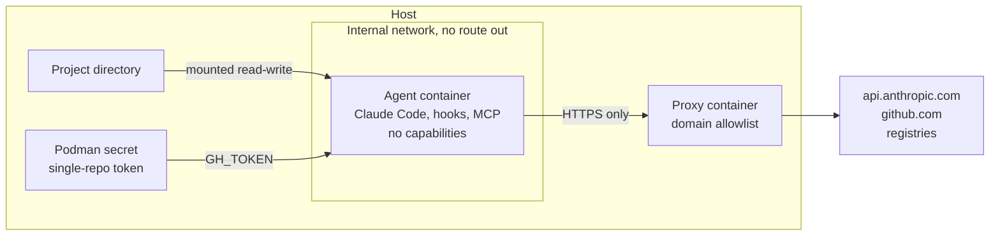

# Sandboxed Coding Agent: Developer Setup Guide

Last updated 2026-09-18

> **Status: tested on one machine.** All three stages, both launcher modes, GPU, perf counters, the token check and the hook-blocking test have been run on Ubuntu 24.04 with Podman 4.9.3. [Test status](#test-status) lists exactly what was checked and the few things that were not. Expect differences on other distributions and Podman versions.

## Overview

This guide puts Claude Code, together with its hooks and MCP servers, inside a rootless Podman container. The container can see one project directory, can reach a short list of domains, and holds one GitHub token that works on one repository.



How to read the diagram:

- **The agent container has no route to the internet.** Its network is created with `--internal` and with DNS switched off, so the agent cannot even look up an outside host. It reaches the proxy by IP address.
- **The proxy container is the only way out.** It allows HTTPS to the domains in an allowlist file and refuses everything else. In untrusted mode it also opens GitHub traffic and lets only reads through. The agent cannot change it, because it runs in a different container.
- **The project directory is the only host path mounted.** Your home directory, SSH keys and cloud credentials are not in the container.
- **The GitHub token is attached only when you start the agent inside a checkout of the repository the token was made for.**

### The scripts

| Step | You run | You get |
| --- | --- | --- |
| Stage 1. Podman | `01-setup-podman.sh` | Rootless Podman, GPU access through CDI, the agent image, the proxy image, two internal networks |
| Stage 2. GitHub | `02-github-single-repo.sh OWNER/REPO` | A token for that repository only: read, commit, push, comment. Stored as a Podman secret |
| Stage 3. Claude Code settings | Nothing for the container. `03-claude-settings.sh` for the host | In the container: repo hooks and MCP servers blocked, merge denied, force-push gated. On the host: secrets unreadable to the agent |
| Daily use | `agent-run.sh [--gpu] [--perf]` | Claude Code on the current directory, inside the sandbox, in auto permission mode |
| New untrusted repo | `inspect-repo.sh URL`, then `agent-run.sh --untrusted` | A review of what the repo would auto-run, then a session with no token, no GPU, and a network of the model API plus read-only GitHub |

### Quick path

```bash
git clone https://github.com/corwinjoy/agent-sandbox.git && cd agent-sandbox
export PATH="$PWD/scripts:$PATH"          # add this line to ~/.bashrc to keep it

01-setup-podman.sh                                             # Stage 1, asks for sudo
02-github-single-repo.sh OWNER/REPO                            # Stage 2, opens a GitHub page
03-claude-settings.sh                                          # Stage 3, host side

cd ~/src/myrepo && agent-run.sh                                # first run asks you to log in to Claude
```

### What this does not give you

- **It is a shared-kernel sandbox.** A Linux kernel or NVIDIA driver bug can still reach the host. [Alternatives](#alternatives) says when to use a VM-based sandbox instead.
- **The project directory is writable.** The agent can change any file in it, including build scripts that run with your privileges if you later run them on the host. Two git-specific routes are handled: `.git/hooks` is mounted read-only, and the launcher shows you what changed in `.git/config` after each session. See [Git hooks and git config](#git-hooks-and-git-config).
- **`github.com` is on the trusted-mode allowlist,** so data can be sent there. The single-repo token limits where it can be written. In untrusted mode the proxy refuses GitHub writes itself.
- **The GitHub token is an environment variable inside the container.** Anything running there can read it. Its single-repository scope and expiry are the limit. [Appendix F](#appendix-f-nvidia-openshell-in-detail) describes a design where the credential never enters the sandbox.

### Terms used in this guide

| Term | Meaning |
| --- | --- |
| Rootless Podman | Podman run by your normal user, with no root daemon. Root inside the container maps to an unprivileged id on the host |
| CDI | Container Device Interface. A file, `/etc/cdi/nvidia.yaml`, that tells Podman which device nodes and driver libraries make up "the GPU" |
| Internal network | A Podman network created with `--internal`. Containers on it can talk to each other and to nothing else |
| Fine-grained token | A GitHub personal access token (`github_pat_...`) limited to chosen repositories and chosen permissions. Classic tokens (`ghp_...`) cannot be limited to one repository |
| Podman secret | A value Podman stores outside any container and injects at start. Here it becomes the `GH_TOKEN` environment variable |
| Managed settings | `/etc/claude-code/managed-settings.json`. The one Claude Code settings level that a repository's own settings cannot override |
| Hook | A command Claude Code runs automatically at a lifecycle event. A repository can define hooks in `.claude/settings.json` |
| MCP server | A helper process that gives Claude extra tools. A repository can ask for one to be started in `.mcp.json` |

## Before you start

### Requirements

- Ubuntu 24.04, or another apt-based distribution with **Podman 4.3 or later** and the netavark network backend. Ubuntu 22.04 ships Podman 3.4, which is too old. `01-setup-podman.sh` checks the version and stops if it is too old.
- `git`, `curl` and `jq` on the host.
- For GPU work: an NVIDIA GPU with the driver and the NVIDIA Container Toolkit installed on the host.

### Fix these host problems first

Each one lets code running as you skip the sandbox entirely. `01-setup-podman.sh` checks for them and prints a warning.

| Check | Command | Needs to be | Fix |
| --- | --- | --- | --- |
| Not in the `docker` group | `id -nG` | `docker` absent | `sudo gpasswd -d $USER docker`, then log out and in |
| Not in the `lxd` group | `id -nG` | `lxd` absent | `sudo gpasswd -d $USER lxd` |
| runc, only if you keep Docker installed | `runc --version` | 1.2.8 or later on the 1.2 branch, 1.3.3 or later on 1.3, or 1.4.0-rc.3 or later. Versions 1.3.0 to 1.3.2 are still vulnerable | Update Docker Engine and containerd |
| NVIDIA Container Toolkit (GPU users) | `nvidia-ctk --version` | 1.17.8 or later | Update from NVIDIA's apt repository |
| NVIDIA driver (GPU users) | `nvidia-smi` | A release from October 2025 or later. On the 580 branch that is 580.95.05 | Update the driver |
| Claude Code on the host | `claude --version` | Current release | Leave auto-update on |

**Why.** Membership of the `docker` or `lxd` group is root on the host: `docker run -v /:/host` needs no password. Older runc and NVIDIA toolkit versions have published container escapes to host root. [Appendix A](#appendix-a-how-the-sandbox-is-built-and-its-limits) has the CVE details.

## Stage 1: Podman

**Why.** Claude Code's built-in sandbox covers Bash commands only. Hooks and MCP servers run on the host as you, and the sandbox cannot expose a GPU. Putting the whole agent in a container covers all three. Rootless Podman has no root daemon and no root-equivalent group, so a container-runtime bug lands an attacker in your unprivileged account, not in root. [Alternatives](#alternatives) compares the other options, and [Appendix A](#appendix-a-how-the-sandbox-is-built-and-its-limits) explains the design.

**Run it.**

```bash
01-setup-podman.sh
```

If you need the CUDA toolkit (`nvcc`, headers) inside the container, build on a CUDA base image instead of plain Ubuntu. The NVIDIA driver libraries are injected at run time either way. The choice is remembered in `~/.config/agent-sandbox/base-image`, so later plain re-runs rebuild on the same base. The CUDA image is about 8 GB.

```bash
BASE_IMAGE=docker.io/nvidia/cuda:12.6.3-devel-ubuntu24.04 01-setup-podman.sh
```

The script is safe to re-run. It uses `sudo` for `apt`, for writing `/etc/cdi`, and for adding your `/etc/subuid` and `/etc/subgid` entries if they are missing.

**What it sets up.**

| Piece | Purpose |
| --- | --- |
| `podman`, `uidmap`, `passt`, `slirp4netns`, `crun` | Rootless containers and their networking. `crun` is Podman's low-level runtime. Keep it updated through apt like any other package |
| `/etc/subuid`, `/etc/subgid` entries | The id ranges user namespaces need. Added only where missing, in a range no other user has |
| `/etc/cdi/nvidia.yaml` | Lets a container request the GPU with `--device nvidia.com/gpu=all`. Regenerate it after each driver update by re-running the script. If your Podman cannot read the spec that the NVIDIA toolkit writes, the script installs a compatible copy; see [Troubleshooting](#troubleshooting) |
| `~/.config/agent-sandbox/seccomp-perf.json` | Podman's default seccomp profile with `perf_event_open` moved from its deny rule to an allow rule. Used only with `--perf` |
| `~/.config/agent-sandbox/allowed-domains*.txt` | The egress allowlists. Your copies; the script never overwrites them |
| `localhost/agent-claude` image | Ubuntu, Claude Code, git, gh, Python, build tools, perf, the non-root user `agent`, managed settings, git config |
| `localhost/agent-proxy` image | Squid, running as its own unprivileged user with no capabilities. Allows HTTPS tunnels to allowlisted domains; for GitHub in untrusted mode it terminates TLS with a CA of its own and allows only reads |
| `agent-proxy*-ca` and `agent-proxy*-ca-pub` volumes | Created on first use: the proxy's inspection CA key (mounted by the proxy only) and its public certificate (mounted read-only by untrusted sessions) |
| `agent-internal`, `agent-untrusted` networks | Created with `--internal --disable-dns`: no route to the outside and no name resolution |

**The script:** [`scripts/01-setup-podman.sh`](../scripts/01-setup-podman.sh), commented step by step. The container build files it uses are in [`scripts/container/`](../scripts/container/).

**Check it worked.**

```bash
podman images | grep agent-          # two images: agent-claude and agent-proxy
podman network ls | grep agent-      # two networks: agent-internal and agent-untrusted
podman run --rm --device nvidia.com/gpu=all docker.io/library/ubuntu:24.04 nvidia-smi -L   # GPU users: lists your GPU
```

## Stage 2: GitHub for a single repository

**Why.** A prompt-injected agent uses whatever credential it holds. In the 2025 GitHub MCP exploit, a malicious issue in a public repository made an agent copy private-repository data into a public pull request. The only precondition was one token that covered both. A token that works on one repository has nothing else to leak. Details in [Appendix B](#appendix-b-github-permissions-in-detail).

**Permissions the token gets.**

| Fine-grained permission | Level | Lets the agent |
| --- | --- | --- |
| Contents | Read and write | Clone, fetch, commit, push |
| Issues | Read and write | Read issues, add comments |
| Pull requests | Read and write | Open pull requests, add comments and review comments |
| Metadata | Read-only | Added by GitHub automatically |

Left off on purpose: Workflows (so it cannot edit `.github/workflows`), Administration, Secrets, Webhooks, Actions, and every other repository.

**Run it.**

```bash
02-github-single-repo.sh myorg/myrepo
```

What happens, step by step:

1. The script opens GitHub's token page with the name, owner, 30-day expiry and the three permissions [pre-filled from URL parameters](https://docs.github.com/en/authentication/keeping-your-account-and-data-secure/managing-your-personal-access-tokens). GitHub has no API for creating fine-grained tokens, so this part is by hand.
2. Under "Repository access" you choose "Only select repositories" and pick the one repository. The link cannot pre-fill this field, and it is the one that matters most.
3. You generate the token and paste it into the script. The input is hidden.
4. The script refuses classic (`ghp_`) tokens, confirms the repository is readable, prints the expiry, and fails if the token can see any other private repository.
5. It stores the token as a Podman secret named `gh-OWNER-REPO`.

Options: `--expires-days N` changes the expiry. `--canary OWNER/OTHER` names another private repository of yours and fails unless the token gets a 404 for it.

**The script:** [`scripts/02-github-single-repo.sh`](../scripts/02-github-single-repo.sh), commented step by step. The permissions are fixed by this part:

```bash
URL="https://github.com/settings/personal-access-tokens/new"
URL+="?name=$NAME"
URL+="&description=Coding+agent%3A+single+repo+$OWNER%2F$REPO"
URL+="&target_name=$OWNER"            # personal account or organization that owns the repo
URL+="&expires_in=$EXPIRES"           # short-lived on purpose; re-run this script to rotate
URL+="&contents=write"                # commit and push
URL+="&issues=write"                  # comment on issues
URL+="&pull_requests=write"           # open PRs, comment on PRs
```

**Where the token lives.** Podman's default secret store is a file under `~/.local/share/containers/storage/secrets`. It is base64-encoded, not encrypted, and readable only by your user. It is never in the project directory, on a command line or in `podman inspect` output. Stage 3 stops host-side agent sessions from reading that path.

**Inside the container** the token arrives as the `GH_TOKEN` environment variable. The image's `/etc/gitconfig` has a credential helper that hands it to git for `https://github.com` only. It also rewrites `git@github.com:` remotes to HTTPS, because the container has no SSH keys and no route except the proxy. The `gh` CLI reads `GH_TOKEN` by itself.

**Check it worked.** From a checkout of the repository, on the host:

```bash
cd ~/src/myrepo
agent-run.sh --check-token
```

The repository name is taken from the checkout's `origin`, so there is nothing to fill in. The check runs inside the sandbox, because that is the only place the token exists. It never prints the token and changes nothing on GitHub.

```text
GitHub token attached for myorg/myrepo
Token check for myorg/myrepo

1. The token itself
  [pass] fine-grained token
  [pass] expires 2026-12-31 08:00:00 UTC

2. What it can do on myorg/myrepo
  [pass] API can read it (private repository)
  [pass] git can fetch
  [pass] git can push (Contents: write)

3. What it can reach elsewhere
  [pass] no other private repository is visible to the token
  [pass] cannot push to myname/some-other-repo (HTTP 403)
  ...
RESULT: PASS
```

The read and push checks ask git's own HTTPS endpoints whether this credential may fetch or push; GitHub answers 200 only if it may, and nothing is pushed. The "elsewhere" checks list the private repositories the token can see, then ask the push endpoint of up to three other repositories it can list, which are usually your own. Any `[FAIL]` line says what to do.

To probe a specific repository as well, name it after `--`: `agent-run.sh --check-token -- myorg/another-repo`.

**Reading a public repository proves nothing.** Every token, and no token at all, can read public repositories, so `gh api repos/myorg/some-public-repo` succeeding does not mean the token was granted access to it. What matters is that it cannot write there, and cannot read other private repositories. The check tests exactly those two things.

**Rotate or revoke.** Re-run the script to rotate; it replaces the secret. To revoke, delete the token at <https://github.com/settings/personal-access-tokens> and run `podman secret rm gh-myorg-myrepo`.

**Branch protection is not part of this setup.** The token can push to any branch of its repository, including the default branch, and can merge a pull request. Whether the default branch requires pull requests, reviews or status checks is a setting of the repository, decided by its owners: see GitHub's [rulesets](https://docs.github.com/en/repositories/configuring-branches-and-merges-in-your-repository/managing-rulesets/about-rulesets) and [protected branches](https://docs.github.com/en/repositories/configuring-branches-and-merges-in-your-repository/managing-protected-branches/about-protected-branches). The sandbox's job is to make sure the agent holds a credential for one repository and nothing else. [Appendix B](#what-the-token-can-still-do) says what that credential can still do.

## Stage 3: Claude Code settings

**Why.** A repository can ship its own `.claude/settings.json`, and project settings outrank your user settings. A user-level `disableAllHooks: true` can be switched back off by the repository. Managed settings are the one level a repository cannot override, so the rules that matter go there. Details in [Appendix C](#appendix-c-claude-code-settings-in-detail).

There are two places to configure, and they do different jobs.

| Where | File | How it gets there | Job |
| --- | --- | --- | --- |
| Inside the container | `/etc/claude-code/managed-settings.json` | Built into the image by Stage 1. Nothing to run | Stop a repository's hooks and MCP servers from running. Keep merge and force-push in your hands |
| On the host | `~/.claude/settings.json` | `03-claude-settings.sh` | Protect your secrets for the times you run `claude` outside the container |

### Inside the container: managed settings

To change them, edit [`scripts/container/managed-settings.json`](../scripts/container/managed-settings.json) and re-run `01-setup-podman.sh` to rebuild the image.

```json
{
  "allowManagedHooksOnly": true,
  "allowManagedMcpServersOnly": true,
  "allowedMcpServers": [],
  "enableAllProjectMcpServers": false,
  "permissions": {
    "deny": [
      "Bash(gh pr merge *)",
      "Bash(gh repo delete *)",
      "Bash(gh secret *)",
      "Bash(gh auth token*)"
    ],
    "ask": [
      "Bash(git push --force*)",
      "Bash(git push -f *)",
      "Bash(git push * --force*)"
    ]
  }
}
```

| Key | Effect |
| --- | --- |
| `allowManagedHooksOnly` | Blocks hooks from user, project, local and plugin settings. A cloned repository's hooks never run |
| `allowManagedMcpServersOnly` with `allowedMcpServers: []` | Only servers on the managed allowlist may load, and [an empty list means none](https://code.claude.com/docs/en/managed-mcp). A repository's `.mcp.json` is ignored |
| `enableAllProjectMcpServers: false` | No blanket approval of project MCP servers |
| `permissions.deny` | The agent opens pull requests and you merge them. Deny rules win over any allow rule from any scope |
| `permissions.ask` | Force-pushes always prompt |

To allow an MCP server you have vetted, add an entry to `allowedMcpServers` that pins what actually runs: `{ "serverCommand": ["npx", "-y", "some-server@1.2.3"] }` for a local server, which must match the command and arguments exactly, or `{ "serverUrl": "https://mcp.example.com/*" }` for a remote one. A remote server's domain also has to be on the proxy allowlist. Anthropic's docs say a `serverName` entry "is not a security control", because anyone can give any server that name.

Bash permission rules match the command text, so they are a guard rail, not a boundary. The boundary is the token's permissions, plus whatever branch protection the repository itself has.

Claude Code's own Bash sandbox is left off inside the container. It needs a weaker nested mode there, and the container plus the proxy already do its job.

### On the host: for the times you run `claude` outside the container

```bash
03-claude-settings.sh            # merge hardening into ~/.claude/settings.json; a dated backup is kept
03-claude-settings.sh --managed  # also install /etc/claude-code/managed-settings.json on the host (sudo)
```

The merge keeps your existing settings and unions lists. It sets:

| Setting | Effect |
| --- | --- |
| `sandbox.enabled`, `sandbox.failIfUnavailable: true` | Bash sandbox on. A hard failure, instead of silently running unsandboxed, when bubblewrap is missing |
| `sandbox.allowUnsandboxedCommands: false` | Removes the retry-outside-the-sandbox escape hatch |
| `sandbox.network.strictAllowlist: true` | Unlisted domains are denied, not prompted |
| `sandbox.credentials` | `~/.ssh`, `~/.aws/credentials`, `~/.config/gh`, `~/.docker/config.json` and Podman's secret store are unreadable to sandboxed commands. `GITHUB_TOKEN`, `GH_TOKEN` and `NPM_TOKEN` are removed from their environment |
| `permissions.deny` Read rules | The same paths, for Claude's Read tool, which the sandbox does not cover |
| `permissions.disableBypassPermissionsMode` | No bypass mode on the host. Use the container for that |

`--managed` installs a host managed-settings file with `allowManagedHooksOnly`. That also blocks your own user-level hooks, so move any you rely on into that file.

**Check it worked.** In a session, run `/status` and look for `Enterprise managed settings (file)` on the `Setting sources` line. Run `claude doctor` to see any setting it rejected. On the host, run `/sandbox` to confirm the mode.

### Test that the sandbox blocks a repository's hooks and MCP servers

Run this once after Stage 1, and again after you change `managed-settings.json` or update Claude Code. It needs a logged-in sandbox and sends one one-line prompt per run.

```bash
test-hook-blocking.sh               # trusted mode: 2 runs
test-hook-blocking.sh --untrusted   # also untrusted mode: 6 runs. Needs the untrusted login too
```

**What it does.** It builds a throwaway repository that tries to get at the agent the way a malicious clone would, then runs short headless Claude sessions in it.

| The repository contains | What it tries |
| --- | --- |
| `.claude/settings.json` with `SessionStart`, `UserPromptSubmit` and `Stop` hooks | Each hook runs `touch /workspace/MARKER_hook_<name>` |
| `.mcp.json` with a server named `probe`, plus `"enableAllProjectMcpServers": true` to pre-approve it | The server command runs `touch /workspace/MARKER_mcp_server_started` |
| `CLAUDE.md` containing a made-up project codename | The test asks the model whether a codename is in its context |

The payloads are harmless: each one only creates an empty marker file in the throwaway project directory, where the script can see it from the host. The directory is deleted afterwards.

The sessions are headless (`claude -p`) on purpose. That is the hardest case: it never shows the workspace trust dialog, so project hooks are used and `.mcp.json` servers connect without asking.

**The runs.** Each protection is switched off in turn, so every layer is tested on its own, and each mode has a control that proves the test can see a hook when one runs. Without a control, "nothing ran" could just mean the test was broken.

| Run | Mode | Managed settings | `--setting-sources user` | What runs | `CLAUDE.md` |
| --- | --- | --- | --- | --- | --- |
| 1. Control | Trusted | Replaced by `{}` | Not used in trusted mode | Hooks and MCP server | Loaded |
| 2. As shipped | Trusted | On | Not used in trusted mode | Nothing | Loaded, by design |
| 3. Control | Untrusted | Replaced by `{}` | Overridden to include the project | Hooks and MCP server | Loaded |
| 4. Flag only | Untrusted | Replaced by `{}` | On | Nothing | Not loaded |
| 5. Managed settings only | Untrusted | On | Overridden to include the project | Nothing | Loaded |
| 6. As shipped | Untrusted | On | On | Nothing | Not loaded |

The script prints what ran in each of these, then `PASS`, `FAIL` or `INCONCLUSIVE`.

What the results mean:

- **Either layer alone stops hooks and MCP servers** (runs 4 and 5). Untrusted mode really has two independent protections, not one.
- **Only `--setting-sources user` keeps `CLAUDE.md` out of the model's context** (runs 4 and 6 against 5). In trusted mode a repository's `CLAUDE.md` is always loaded, as if you wrote it. That is one reason to review a repository before promoting it out of untrusted mode.
- **The controls are a fair picture of the threat.** With no protection, a headless session ran all three hooks and started the repository's MCP server with no prompt of any kind.
- `FAIL` means the sandbox let the repository run something: do not use it on untrusted code until you know why. `INCONCLUSIVE` means nothing ran even in a control, usually because that mode is not logged in.

## Daily use

Start the agent from the project directory. That directory is the only host path the container can see.

```bash
cd ~/src/myrepo
agent-run.sh                    # normal session, auto permission mode. The first run asks you to log in; the login is kept
agent-run.sh --ask              # same, but Claude asks before each action (manual permission mode)
agent-run.sh --gpu              # CUDA work
agent-run.sh --gpu --perf       # CUDA plus hardware perf counters
agent-run.sh --shell            # bash in the container instead of claude, to look around
agent-run.sh -- --resume        # everything after -- is passed to claude
agent-run.sh -- -p "summarise this repo" > summary.txt   # headless; works from scripts and pipelines
```

| Flag | Adds | Cost |
| --- | --- | --- |
| none | Project mounted read-write, proxy-only network, the GitHub token if one exists for this checkout's `origin`, auto permission mode | See [Permission mode](#permission-mode) below |
| `--ask` | Manual permission mode: Claude asks before each action | More prompts |
| `--gpu` | `--device nvidia.com/gpu=all` | Code in the container can send raw ioctls to the host NVIDIA driver. Use it only when the task needs CUDA |
| `--perf` | The seccomp profile that allows `perf_event_open` | That syscall can leak some host information, which is why it is blocked by default. The host also needs `kernel.perf_event_paranoid` at 2 or lower |
| `--untrusted` | See [the next section](#opening-a-new-untrusted-repository) | No push, no GPU, no registries, always manual permission mode |
| `--shell` | bash instead of claude | |
| `--check-token` | Runs the [Stage 2 token check](#stage-2-github-for-a-single-repository) for this checkout and exits | |
| `--audit-egress` | A separate proxy that allows every HTTPS domain and logs it. Trusted mode only | Weaker by design. Use it for one task to learn which domains it needs, then read `egress-report.sh --audit` and go back. See [Growing the allowlist](#growing-the-allowlist) |
| `--gvisor` | `--runtime=runsc`. Experimental and untested | CPU only. It refuses `--gpu` and `--perf`, and you must install gVisor and register it with Podman yourself. See [Why not gVisor](#why-not-gvisor) |

`AGENT_RUN_EXTRA_ARGS` adds options to the `podman run` command, for example one more read-only mount: `AGENT_RUN_EXTRA_ARGS="-v $HOME/datasets:/data:ro" agent-run.sh`. Anything you add can weaken the sandbox, so keep mounts read-only and narrow.

**Every run gets:** a read-only `.git/hooks`, a review of `.git/config` changes when the session ends, no Linux capabilities, `no-new-privileges`, a limit of 2048 processes and 16 GB of memory, a tmpfs `/tmp`, and your host user mapped to the container's `agent` user so files in the project keep your ownership. Claude's login and history live in the `agent-claude-home` volume, not in the project.

### Git hooks and git config

Git runs hooks and obeys `.git/config` on the host, with your privileges, the next time you use git in the checkout. Both live inside the project directory, which the agent can write to, so the launcher treats them specially.

- **`.git/hooks` is mounted read-only.** Nothing in the sandbox can add or change a hook, and the directory cannot be moved aside. Inside the container hooks never run anyway, because the image sets `core.hooksPath=/dev/null`. Tools that install hooks, such as husky or pre-commit, report `Read-only file system`; run their install step on the host yourself, after reading what they install.
- **`.git/config` stays writable,** because ordinary git use needs it: `git push -u`, a new remote, a new branch. It can also make git run commands, for example through `core.hooksPath`, `core.fsmonitor`, `core.sshCommand`, an alias that starts with `!`, or a filter. So when a session ends, the launcher prints a diff of `.git/config` if it changed, and adds a warning that lists any new line able to run a command:

```text
agent-run: .git/config changed during this session:
    +	hooksPath = /workspace/.evil-hooks
    +[branch "feature"]
    +	note = harmless
agent-run: WARNING: these new lines can make git run a command ON THE HOST. Check them
           before you run git in this checkout:
    	hooksPath = /workspace/.evil-hooks
```

  Read it before you run git in that checkout. A changed branch or remote is normal; a new `hooksPath`, alias or helper is not. The warning is a pattern match, so treat the diff itself as the record.
- This does not cover everything git reads. `.gitattributes` and `.gitmodules` are ordinary project files; review them in the diff like any other change.

### Permission mode

The launcher starts Claude Code in **auto mode** for trusted sessions: a safety classifier approves routine actions instead of prompting you for each one. Anthropic describes the classifier as "a per-action control, not an isolation boundary", which is why it is the default only here, where the container, the proxy and the single-repo token limit what a wrongly approved action can do. Fewer prompts also means the ones you do see get read.

- The managed rules from Stage 3 still hold in auto mode. Deny rules are evaluated first in every mode, so `gh pr merge` stays blocked, and Anthropic's docs say an ask rule still prompts "even in auto mode", so a force-push still asks you.
- Two things are outside the container's protection, and in auto mode the classifier is the main per-action check on them: pushes and comments made with the GitHub token, and edits to files in the project. If that matters for a repository, protect its default branch in the repository's own settings, and review the diff before you run anything from the project on the host.
- `--untrusted` always uses manual mode. Unreviewed code is where prompt injection is likeliest, and a classifier judges whether an action fits the request, which is exactly what an injection attacks.
- The launcher passes `--permission-mode`, so the mode does not depend on a settings file inside the container. A `--permission-mode` you pass after `--` takes precedence. If auto mode is not available on your account, Claude Code falls back to prompting.
- This applies inside the sandbox only. Do not make auto mode the default in your host `~/.claude/settings.json`: on the host, hooks and MCP servers run outside any boundary.

**What feels different from running `claude` on the host.**

- Claude's WebFetch tool runs inside the container, so it only reaches allowlisted domains. Web search runs on Anthropic's side and is not affected.
- Tools that ignore `HTTPS_PROXY` cannot reach the network at all.
- The agent has no `sudo` and cannot `apt install`. Add packages to [`Containerfile.agent`](../scripts/container/Containerfile.agent) and rebuild.
- Your host `~/.claude` settings, memory and MCP servers are not used. The container has its own state.

**Housekeeping.**

| Task | Command |
| --- | --- |
| Change the allowlist | Edit `~/.config/agent-sandbox/allowed-domains.txt`, then `podman rm -f agent-proxy`. The next `agent-run.sh` starts a fresh proxy |
| See what was allowed or refused, per domain | `egress-report.sh`, `egress-report.sh --untrusted`, `egress-report.sh --audit`; add `--raw` for the log lines |
| Update Claude Code or the image | Re-run `01-setup-podman.sh` |
| Reset Claude's state and login | `podman volume rm agent-claude-home` |

### Growing the allowlist

Treat the allowlist like a firewall rule set: start narrow, and widen it from evidence rather than guesses. This is the workflow OpenShell documents as `audit` then `enforce`.

1. Run the task in enforcing mode. If a tool fails to reach a site, `egress-report.sh` shows the refused domain in its right-hand column.
2. When you cannot tell what a task needs, run it once with `agent-run.sh --audit-egress`. That starts a separate proxy, `agent-proxy-audit`, which allows every HTTPS domain and logs it. Plain HTTP stays refused, the agent stays on the internal network, and untrusted mode refuses the flag.
3. `egress-report.sh --audit` lists every domain the task used. Add the narrowest names that work to `~/.config/agent-sandbox/allowed-domains.txt`, then `podman rm -f agent-proxy` so the next session starts a fresh enforcing proxy.
4. Remove the audit proxy when you are done: `podman rm -f agent-proxy-audit`.

Every domain you add is a place data can be sent. Prefer an exact host to a wildcard, and a registry mirror you control to a public one.

## Opening a new untrusted repository

Never open an unreviewed repository with an agent or an editor on the host. Clone it without running anything, read what it would auto-run, then work on it only in `--untrusted` mode until you have reviewed it.

**Why.** A cloned repository can carry hooks, MCP server commands, environment overrides, editor tasks that run on folder open, and package install scripts. These have caused code execution and API-key theft in Claude Code (CVE-2025-59536 and CVE-2026-21852, both fixed). They still run silently in Cursor, which ships with Workspace Trust off. Details in [Appendix C](#appendix-c-claude-code-settings-in-detail).

### Procedure

1. **Clone and inspect from the host, with nothing executed.**

   ```bash
   cd ~/src
   inspect-repo.sh https://github.com/someone/project.git    # clones into ./untrusted/project
   ```

   The clone runs with git hooks disabled, no submodules and no LFS smudge. The script then prints and flags:

   - `.claude/settings.json`, `.claude/settings.local.json`, `.mcp.json`: hooks, `env` overrides such as `ANTHROPIC_BASE_URL`, pre-approved MCP servers, helper commands, shipped allow rules. A committed `settings.local.json` is suspicious in itself, because that file is normally gitignored.
   - `.vscode/tasks.json` tasks with `runOn: folderOpen`, and any `.devcontainer`.
   - `package.json` install-time scripts, `setup.py`, `.npmrc`, submodules.
   - Network and decoding tools (`curl`, `wget`, `nc`, `socat`, `base64`, `openssl`), `eval`, inline interpreters such as `sh -c` and `python -c`, and key paths, anywhere in agent and editor config. Names are matched as whole words, so `"command": "curl"` in JSON is caught too.
   - Invisible Unicode in `CLAUDE.md`, `AGENTS.md`, rules files and READMEs.

2. **Read everything it flagged.** A flag is a prompt to read, not a verdict, and no flags is not a clean bill of health. Read `CLAUDE.md` and `AGENTS.md` in full. Untrusted mode does not load the repository's `CLAUDE.md` automatically, but the agent can still open it, or any other file, while it works. Once you promote the repository to trusted mode, `CLAUDE.md` is loaded into every session as if you wrote it.

3. **Start the agent in untrusted mode.** The first run asks for a separate Claude login, because untrusted sessions keep their own state.

   ```bash
   cd ~/src/untrusted/project
   agent-run.sh --untrusted
   ```

   | Untrusted mode changes | Reason |
   | --- | --- |
   | No GitHub token attached | Nothing to push with, nothing to steal |
   | `--gpu` refused | Keeps the NVIDIA driver out of reach of unknown code |
   | Separate network and proxy, using `allowed-domains-untrusted.txt`: the Anthropic endpoints, plus GitHub through TLS inspection | No registries, and no way to write to GitHub, so nowhere to send data |
   | Read-only GitHub, enforced by the proxy | The proxy terminates TLS for `github.com` and `api.github.com` with its own CA and allows clone, fetch and `GET`. Push, `POST`, `PUT` and `DELETE` get a 403 from the proxy, whatever credentials are presented. Tools trust the CA through `SSL_CERT_FILE`, `GIT_SSL_CAINFO`, `CURL_CA_BUNDLE`, `REQUESTS_CA_BUNDLE`, `PIP_CERT` and `NODE_EXTRA_CA_CERTS`; a tool that ignores all of those sees a certificate error on GitHub and nothing else |
   | Separate `agent-claude-home-untrusted` volume | Nothing the repository writes into Claude's state can affect later trusted sessions |
   | `claude --setting-sources user` | The repository's `.claude/settings*.json`, `.mcp.json` and `CLAUDE.md` are not loaded at all |
   | Manual permission mode | Claude asks before each action. See [Permission mode](#permission-mode) |
   | Managed settings, as always | Hooks and MCP servers from any source stay blocked |

4. **Install dependencies with scripts off.** Add the one registry you need to `~/.config/agent-sandbox/allowed-domains-untrusted.txt` and restart the proxy with `podman rm -f agent-proxy-untrusted`. (`gh` needs a token even for public reads, so use `git` and `curl` in untrusted mode.) Install with `npm ci --ignore-scripts`, or `pip install --only-binary=:all:` so that no `setup.py` runs. Then remove the registry again.

5. **Do not run the repository's code on the host.** Tests, builds and `make` targets run inside the container. Anything in the project directory, including Makefiles and `package.json` scripts the agent may have changed, runs with your full privileges if you run it outside.

6. **Promote it once you have reviewed it.** Move the checkout out of `untrusted/`, create a token with Stage 2 if you need to push, and use plain `agent-run.sh`. If you open it in an editor, turn Workspace Trust on first. In Cursor, set `security.workspace.trust.enabled: true` and `task.allowAutomaticTasks: off`.

7. **For code you consider hostile, use a VM-based sandbox or a throwaway cloud machine instead.** This container shares your kernel. See [Alternatives](#alternatives).

**What untrusted mode does not stop.** Text the agent reads while it works, such as source files, READMEs, issue text pasted into the session and test output, can still carry instructions aimed at the model. Untrusted mode limits what a misled agent can do: no token, no network beyond the model API, no GPU, and a prompt before each action. Arguments you pass after `--` go to `claude` unchanged and can override the launcher's flags, so do not pass `--setting-sources` or `--permission-mode` yourself in untrusted mode. The managed settings hold either way.

## Troubleshooting

| Symptom | Likely cause | Fix |
| --- | --- | --- |
| A tool cannot reach a site, or `Connection reset by peer` right after connecting | The domain is not on the allowlist, so the proxy reset the tunnel | `egress-report.sh` shows it in the refused column. Add the domain, then `podman rm -f agent-proxy`. Unsure what a task needs? See [Growing the allowlist](#growing-the-allowlist) |
| `The requested URL returned error: 403` from git or curl on GitHub in untrusted mode | The proxy refused a write: push, `POST`, `PUT` or `DELETE`. Reads work | Deliberate. Promote the repository to trusted mode when you have reviewed it |
| `SSL certificate problem` or `self-signed certificate` on GitHub in untrusted mode | A tool that ignores every CA environment variable met the proxy's inspection certificate | Point the tool at `/etc/agent-sandbox/ca/ca-bundle.pem` with its own option, or use `git` or `curl` instead. Other domains are not inspected and are unaffected |
| Every outside domain fails, even allowlisted ones | The proxy cannot resolve names. It uses the DNS servers in `~/.config/agent-sandbox/squid-dns.conf`, which the launcher writes from the host's resolvers | Put resolvers that work from your network on the `dns_nameservers` line, then `podman rm -f agent-proxy` |
| `could not find the proxy's address`, or every request times out | The proxy container is not running | `podman ps -a` and `podman logs agent-proxy`. Remove it with `podman rm -f agent-proxy` and start `agent-run.sh` again |
| `getent hosts` or `ping` cannot resolve anything inside the container | Expected. DNS is off on purpose; programs reach the network through the proxy, which does the lookups | Make sure the tool honours `HTTPS_PROXY` |
| `Error: setting up CDI devices: unresolvable CDI devices nvidia.com/gpu=all` | Podman cannot parse the CDI spec. Seen with Podman 4.9.3 and NVIDIA Container Toolkit 1.20: the toolkit writes an `additionalGids` field that the older parser rejects. `podman --log-level=debug run ... 2>&1 \| grep -i cdi` shows `unknown field "additionalGids"` | Re-run `01-setup-podman.sh`. Its last step detects this and installs a copy of the spec without that field, which CUDA does not need |
| `nvidia-smi` fails inside the container | CDI spec missing or stale after a driver update | Re-run `01-setup-podman.sh`, then check `nvidia-ctk cdi list` |
| `perf stat` shows `<not supported>` or permission denied | `--perf` not passed, or `kernel.perf_event_paranoid` above 2 on the host | Pass `--perf`. On the host: `sudo sysctl kernel.perf_event_paranoid=2` |
| Files in the project end up owned by a strange uid | Podman older than 4.3, so `--userns=keep-id:uid=...` was not honoured | Upgrade Podman |
| `Read-only file system` when a tool writes to `.git/hooks` (husky, pre-commit, lefthook) | Deliberate: see [Git hooks and git config](#git-hooks-and-git-config) | Run the tool's hook-install step on the host, after reading what it installs |
| `git push` asks for a username | No token attached. The launcher prints which repository it looked for | Run Stage 2 for that repository. Check that `git remote get-url origin` points at it |
| Claude asks you to log in every time | The state volume is missing or was removed | `podman volume ls`. Use the same mode each time: trusted and untrusted modes have separate logins |
| On SELinux hosts, permission denied on `/workspace` | The mount needs relabelling | Add `,Z` to the project mount in `agent-run.sh`. For `--gpu` also add `--security-opt label=disable`, as in NVIDIA's CDI example |

## Removing everything

```bash
podman rm -f agent-proxy agent-proxy-untrusted
podman rmi localhost/agent-claude localhost/agent-proxy
podman network rm agent-internal agent-untrusted
podman rm -f agent-proxy-audit
podman volume rm agent-claude-home agent-claude-home-untrusted
podman volume rm $(podman volume ls -q | grep '^agent-proxy.*-ca')   # the proxy inspection CAs
podman secret ls                     # then: podman secret rm gh-OWNER-REPO for each
rm -rf ~/.config/agent-sandbox
sudo rm -f /etc/claude-code/managed-settings.json   # only if you ran 03-claude-settings.sh --managed
sudo rm -f /etc/cdi/nvidia.yaml                     # only if nothing else on the machine uses CDI
ls ~/.claude/settings.json.bak.*     # restore the backup you want over ~/.claude/settings.json
```

Also delete the tokens at <https://github.com/settings/personal-access-tokens>.

## Testing the scripts

The repository has a test suite, and GitHub Actions runs it on every push and pull request. It can also be started by hand from the repository's Actions tab, which is worth doing now and then: the Claude Code installer, Ubuntu's Podman packages and the container base image all change outside this repository. Run the suite yourself before you change a script:

```bash
tests/run-tests.sh                 # static checks and unit tests: a few seconds, no Podman needed
tests/run-tests.sh --integration   # also the integration tests: about a minute, needs a finished Stage 1
```

| Suite | Needs | What it checks |
| --- | --- | --- |
| Static, [`tests/static.sh`](../tests/static.sh) | bash, jq, python3, shellcheck (or Podman to run it) | Syntax and shellcheck for every script. The managed settings still block hooks and MCP servers. The untrusted allowlist has no GitHub or registry. [`tests/check-docs.py`](../tests/check-docs.py): every anchor and file link in this guide and the README resolves, the JSON and the token URL shown here match the files, every script is in Appendix D, and every launcher flag is documented |
| Unit, [`tests/unit.sh`](../tests/unit.sh) | Nothing else. `podman`, `gh` and `curl` are stubs | The `podman run` command line the launcher builds in each mode, and every refusal. Untrusted mode never gets the token, even when one is stored. The `.git/config` review flags a planted `hooksPath` and stays quiet about a harmless change. The runc version table, the subuid range picker, the settings merge (keeps your settings, idempotent), the repository inspector against a hostile and a clean fixture, and the token check against well-scoped, over-scoped and classic tokens |
| Integration, [`tests/integration.sh`](../tests/integration.sh) | Rootless Podman and the images from Stage 1 | In a real container: runs as `agent`, files written inside are yours on the host, empty capability bounding set, `no-new-privileges`, host home not visible, allowlisted domain connects, other domains get 403, no direct route, no DNS, `.git/hooks` read-only, a planted `core.hooksPath` is reported. Untrusted mode cannot reach GitHub and has no token. In CI this runs after a real `01-setup-podman.sh` |

What the suite cannot cover, because it needs a Claude login, a GitHub token, a GPU or hardware counters: [`test-hook-blocking.sh`](#test-that-the-sandbox-blocks-a-repositorys-hooks-and-mcp-servers), `agent-run.sh --check-token` against a real token, `--gpu` and `--perf`. Run those by hand after changes that touch them; [Test status](#test-status) records the last results.

## Alternatives

This setup is one point in a range. It was chosen because it is the strongest option that still gives CUDA on a GPU the desktop is using, plus hardware perf counters. If you need neither, a VM-based option is the better sandbox.

| Option | Boundary | Covers hooks and MCP servers | CUDA on a GPU that is in use | Hardware perf counters | Main catch |
| --- | --- | --- | --- | --- | --- |
| Claude Code's built-in sandbox (`/sandbox`) | Shared kernel, per Bash command | No | No | Yes | Bash only |
| Anthropic `sandbox-runtime` (`srt`) | Shared kernel, whole process | Yes | No | Yes | Beta. No device access |
| Plain Docker container or dev container | Shared kernel, root daemon | Yes | Yes | Only with a custom seccomp profile | The `docker` group is root on the host, and runtime escapes land in a root daemon |
| **This setup: rootless Podman, proxy, single-repo token** | Shared kernel, unprivileged runtime | Yes | Yes | Yes, with `--perf` | Kernel and NVIDIA driver bugs can still reach the host |
| gVisor (`runsc`) | User-space kernel in front of the host kernel | Yes | Only rootful, and unofficial on GeForce | No | No GPU in a rootless setup |
| Docker Sandboxes (`sbx`) | Own kernel (microVM) | Agent yes. Local MCP servers run on the host | No: needs a GPU nothing else is using | No | Opaque template. GPU support is experimental |
| NVIDIA OpenShell | Shared kernel on its Docker and Podman drivers (own kernel on its microVM and Kubernetes paths) | Yes, and each allowed endpoint names which binaries may reach it | Yes, through CDI, same as this setup | No: its seccomp filter denies `perf_event_open` | Alpha. Needs Podman 5 or the Docker socket. No host mount. API-key login only |
| Your own VM with GPU passthrough (libvirt, Kata) | Own kernel | Yes | No: the GPU leaves the host while the VM runs | Not verified | Most setup effort. Fragile on laptops |
| Separate GPU machine or cloud GPU instance | Different hardware | Yes | Yes | Yes on bare metal | Cost, and whatever credentials you copy there |
| Claude Code cloud session | Anthropic-managed VM | Yes | No GPU | Not checked | Not for GPU work |

### Which to use

| Your situation | Use |
| --- | --- |
| CUDA on a machine whose GPU is in use, or hardware perf counters, on repositories you trust | This setup: `agent-run.sh --gpu --perf` |
| You want to read and version every line that defines the sandbox | This setup |
| A repository you have not reviewed, no GPU needed | `agent-run.sh --untrusted` |
| No GPU and no profiling, and you want the strongest boundary with the least to maintain | Docker Sandboxes, or another VM-based option |
| Code you consider hostile | Docker Sandboxes in `--clone` mode, your own VM, or a Claude Code cloud session. Not this setup |
| Untrusted code that needs a GPU | A separate machine or cloud GPU instance that holds no credentials |
| A team sharing a GPU cluster, or anyone who wants per-binary and per-request network rules | NVIDIA OpenShell, once it fits your Podman version and login |
| macOS or Windows | Docker Sandboxes |

The options can coexist: this setup for daily GPU work on repositories you trust, and a VM-based sandbox for the occasional one you do not.

### Why not Claude Code's built-in sandbox alone

- It wraps Bash commands only. Anthropic's docs say MCP servers and command hooks ["run unconstrained on the host"](https://code.claude.com/docs/en/sandbox-environments), and recommend a container, a VM or `sandbox-runtime` for unattended work.
- It builds a fresh `/dev` with no NVIDIA device nodes, and so does `sandbox-runtime`. [Issue #13108](https://github.com/anthropics/claude-code/issues/13108), open since December 2025, asks for device passthrough and has no workaround other than disabling the sandbox.
- By default it falls back to unsandboxed when dependencies are missing, and lets failed commands retry outside the sandbox. Stage 3 turns both off for the times you run `claude` on the host.

### Why not a plain Docker container

- The Docker daemon runs as root, and the `docker` group is root-equivalent.
- A container shares the host kernel and is started by a privileged runtime. In November 2025 runc fixed [CVE-2025-52881](https://github.com/opencontainers/runc/security/advisories/GHSA-cgrx-mc8f-2prm) and two related bugs that let a hostile Dockerfile or container gain host root. The maintainers say rootless containers "entirely mitigate" that escalation, because an unprivileged runtime cannot write the procfs files the attack targets. That is the main reason this setup is rootless. [Appendix A](#appendix-a-how-the-sandbox-is-built-and-its-limits) has the details.

### Why not gVisor

[gVisor's nvproxy](https://gvisor.dev/docs/user_guide/gpu/) narrows the NVIDIA driver surface to an allow-list of ioctls and protects against general kernel bugs. It says it is "much less effective" against NVIDIA driver bugs, GeForce cards are unofficial, rootless mode with nvproxy is [broken upstream](https://github.com/google/gvisor/issues/11076), and [`perf_event_open` is unimplemented](https://gvisor.dev/docs/user_guide/compatibility/linux/amd64/). The launcher has an experimental CPU-only `--gvisor` flag for people who install gVisor themselves.

### Why not NVIDIA OpenShell

[OpenShell](https://github.com/NVIDIA/OpenShell) is the most complete design of the group at the network and credential layers, and two of its ideas are now in this setup: refusing GitHub writes at the proxy by HTTP method and path, and an audit mode for growing an allowlist. It is an alpha, its Podman driver needs Podman 5 (Ubuntu 24.04 ships 4.9), its Docker driver needs the Docker socket, its seccomp filter denies `perf_event_open`, it documents API-key login only, and it has nothing Claude-Code-specific, so a repository's hooks and MCP servers run inside its workload. [Appendix F](#appendix-f-nvidia-openshell-in-detail) has the comparison.

### Why not Docker Sandboxes

It is the closest ready-made alternative and the stronger sandbox: each one is a microVM with its own kernel, and secrets never enter it. Three things ruled it out for GPU and profiling work: the agent template is hard to inspect and can change underneath you, GPU passthrough is experimental and needs a GPU the host is not using, and hardware perf counters are not available inside the VM. [Appendix E](#appendix-e-docker-sandboxes-in-detail) has the full comparison, including what it does better.

## Appendix A: how the sandbox is built, and its limits

This appendix explains the design choices behind `01-setup-podman.sh` and `agent-run.sh`. For how the result compares with other tools, see [Alternatives](#alternatives).

### Why rootless, and why patch levels matter

- **Rootless.** In November 2025 runc fixed [CVE-2025-52881](https://github.com/opencontainers/runc/security/advisories/GHSA-cgrx-mc8f-2prm) and two related bugs that let a hostile Dockerfile or container gain host root, fixed per release branch in runc 1.2.8, 1.3.3 and 1.4.0-rc.3. The maintainers say rootless containers "entirely mitigate" the privilege escalation, because an unprivileged runtime cannot write the procfs files the attack targets.
- **Switching runtime is not the fix.** Podman here uses crun, and the same advisory says crun and youki "may have similar security issues". Keep crun updated through apt. What protects you is that the runtime runs without privileges.
- **The NVIDIA toolkit.** [CVE-2025-23266 "NVIDIAScape"](https://www.wiz.io/blog/nvidia-ai-vulnerability-cve-2025-23266-nvidiascape) (CVSS 9.0): a three-line Dockerfile got host root through the NVIDIA Container Toolkit's hook. Fixed in toolkit 1.17.8. It triggers when a container is created from an attacker's image, so never let the agent build or start containers on the host.

### What each launcher flag buys

| Flag in `agent-run.sh` | Stops |
| --- | --- |
| Rootless, `--userns=keep-id` | Root in the container is not root on the host. Project files keep your ownership |
| `--network agent-internal` plus the proxy, `--dns none` | Exfiltration to arbitrary hosts, reverse shells and DNS tunnelling. The agent cannot remove the rule, because it is enforced in another container |
| Proxy: TLS-name check | A tunnel whose TLS name is not on the list is cut, so an allowed tunnel cannot be reused to speak to a different host |
| Proxy: GitHub inspection in untrusted mode | Sending data to GitHub from unreviewed code. Only clone, fetch and `GET` pass |
| `--cap-drop=ALL`, `no-new-privileges` | Raw sockets, mounts, ptrace of other users' processes, setuid escalation |
| Only `$PWD` mounted | Reading `~/.ssh`, cloud credentials, browser profiles, other projects |
| `--pids-limit`, `--memory` | Fork bombs and memory exhaustion |
| Podman secret as `GH_TOKEN` | The token is not on a command line, in `podman inspect`, or in a file in the project |
| `core.hooksPath=/dev/null` in the image | Hooks already in the repository running inside the container |
| `.git/hooks` mounted read-only, `.git/config` reviewed after the session | A hook, or a git setting that runs a command, being planted for git on the host to execute later |

### The GPU trade-off

- CUDA talks to the host NVIDIA kernel driver through `/dev/nvidia*`. With `--gpu`, code in the container can send raw ioctls to that driver. [Quarkslab](https://blog.quarkslab.com/nvidia_gpu_kernel_vmalloc_exploit.html) turned two such bugs into a root shell from an unprivileged process; both are fixed in driver 580.95.05 and in the matching October 2025 releases of the older branches. Keep the driver current and pass `--gpu` only when needed.
- The only way to remove the host driver from the attack surface is to hand the whole GPU to a VM over VFIO. Docker Sandboxes, Kata and libvirt all work that way, and all need [a GPU the host is not using](https://docs.docker.com/ai/sandboxes/configuration/gpu-passthrough/). NVIDIA's GPU-sharing modes are licensed datacenter features.

### How the proxy inspects GitHub in untrusted mode

Squid is built with TLS support (`squid-openssl`). On first start the proxy generates a CA of its own, keeps the key in a volume only it mounts, and publishes the certificate plus a bundle (the public roots first, then its own certificate) to a volume that untrusted sessions mount read-only. For the two inspected names the proxy terminates TLS, issues a certificate for the name on the fly, and applies method and path rules: `GET`, `HEAD`, `OPTIONS` and the `git-upload-pack` `POST` that clone and fetch need are allowed; anything mentioning `git-receive-pack`, and every other write method, is refused with a 403. Every other domain is relayed unread, exactly as in trusted mode, so the proxy never sees Claude's API traffic. Trusted mode inspects nothing and mounts no CA. A refused tunnel is reset rather than answered, because on a TLS-capable port Squid would otherwise serve its error page over a certificate of its own.

This is the design OpenShell and Docker Sandboxes use for credential injection and request rules, applied to one domain pair. Its cost is that tools inside the sandbox have to trust the proxy's CA for those names; the launcher sets the usual variables, and a tool that ignores all of them gets a certificate error on GitHub only.

### What the proxy cannot do

It cannot tell which process opened a connection. OpenShell's supervisor can, because it sits inside the sandbox and brokers every `connect()`; that lets a policy say "only `git` may reach github.com". Squid sees a TCP connection from the container and no more. That is the largest gap between this setup and OpenShell, and closing it means a component inside the container, not a proxy setting. See [Appendix F](#appendix-f-nvidia-openshell-in-detail).

### Perf counters

Docker's default seccomp profile [blocks `perf_event_open`](https://docs.docker.com/engine/security/seccomp/) as a host information leak, and Podman's default derives from it. `--perf` swaps in a copy of Podman's profile with that one syscall allowed. Appending an allow rule is not enough, because the default profile also lists the syscall in an explicit deny rule and the deny wins; the setup script removes it from that rule. The host also needs `kernel.perf_event_paranoid` at 2 or lower; Ubuntu's default is higher. On the test machine, `perf stat -e cycles,instructions,cache-misses` inside the container failed without `--perf` and returned real hardware counters with it.

### What NVIDIA's AI red team asks of any agent sandbox

[Their January 2026 guidance](https://developer.nvidia.com/blog/practical-security-guidance-for-sandboxing-agentic-workflows-and-managing-execution-risk/) lists three mandatory controls: an egress allowlist, no writes outside the workspace, and no writes to agent config, hooks or MCP config. This setup meets the first two. For the third, managed settings make repo-written hooks and MCP config inert, but the agent can still edit `CLAUDE.md` in the project. They also recommend VMs over shared-kernel sandboxes, injected short-lived secrets, and recreating sandboxes regularly.

### DNS is switched off for the agent

Current Podman documentation says that DNS on an `--internal` network [answers only container names](https://docs.podman.io/en/latest/markdown/podman-network-create.1.html). On the test machine (Podman 4.9.3, aardvark-dns 1.4.0) it did not: a container on the internal network resolved `example.com`. A resolver that forwards outside names is a slow but real channel for leaking data, so the setup does not depend on the Podman version:

- The networks are created with `--disable-dns`, and the agent container runs with `--dns none`, so lookups fail at once.
- The launcher reads the proxy's IP address on the internal network and passes it in `HTTPS_PROXY`. Programs hand the host name to the proxy, and the proxy resolves it.
- Squid does its own lookups with the servers in `~/.config/agent-sandbox/squid-dns.conf`. `agent-run.sh` writes that file each time it starts the proxy, from the host's upstream resolvers (`/run/systemd/resolve/resolv.conf`, then `/etc/resolv.conf`, skipping loopback addresses), and falls back to `1.1.1.1` and `9.9.9.9`.

## Appendix B: GitHub permissions in detail

The token is the real boundary for anything the agent does on GitHub; settings and prompts are guard rails on top of it.

### The exploit this defends against

[Invariant Labs, May 2025](https://invariantlabs.ai/blog/mcp-github-vulnerability): an attacker files an issue with hidden instructions in a public repo. The user asks their agent to look at open issues. The agent reads the issue, pulls data from the user's private repos, and publishes it in a pull request on the public repo. It worked against Claude 4 Opus, so model alignment is not a defence. Invariant notes GitHub "cannot resolve this vulnerability through server-side patches". The precondition was one token spanning a public repo others can write to and the user's private repos. [Simon Willison](https://simonwillison.net/2025/Jun/16/the-lethal-trifecta/) calls the general pattern the lethal trifecta: private data, untrusted content, and a way to send data out.

### Why a fine-grained token

| Credential | Per-repo scoping | Verdict |
| --- | --- | --- |
| Classic PAT (`ghp_...`) | None. The `repo` scope reaches every repo you can access | The script refuses these |
| `gh auth login` OAuth token | None | Keep it on the host. It never enters the container |
| Fine-grained PAT (`github_pat_...`) | Selected repos, per-permission levels, expiry | Used here. [GitHub recommends them](https://docs.github.com/en/authentication/keeping-your-account-and-data-secure/managing-your-personal-access-tokens) over classic tokens |
| Deploy key | One repo, git only | Cannot comment, so not enough here |
| GitHub App or machine-user account | Own identity, short-lived tokens | Stronger. See below |

### What each permission maps to

From GitHub's [permissions reference for fine-grained tokens](https://docs.github.com/en/rest/authentication/permissions-required-for-fine-grained-personal-access-tokens):

| Action | Permission needed | In this token? |
| --- | --- | --- |
| Clone, fetch, push commits | Contents: write | Yes |
| Comment on an issue | Issues: write | Yes |
| Open a pull request, comment or review-comment on one | Pull requests: write | Yes |
| Merge a pull request | Contents: write | Yes, as a side effect |
| Edit files under `.github/workflows/` | Workflows: write | No |
| Change settings, secrets, webhooks, collaborators | Administration and others | No |
| Anything in another repository |  | No |

### What the token can still do

- **Push to any branch, delete branches, and merge a pull request.** Contents: write covers all of these; GitHub has no narrower level. The managed settings deny `gh pr merge` as a guard rail, but the limit that counts is the repository's own branch protection. That is repository configuration, not part of this sandbox: if the default branch must only change through reviewed pull requests, set that up with GitHub's [rulesets](https://docs.github.com/en/repositories/configuring-branches-and-merges-in-your-repository/managing-rulesets/about-rulesets) or [protected branches](https://docs.github.com/en/repositories/configuring-branches-and-merges-in-your-repository/managing-protected-branches/about-protected-branches).
- **Act as you.** The token carries your identity, so a rule that lets you push or merge lets the agent do it too. A required review does bind it, because GitHub does not let an author approve their own pull request. For a rule that separates you from the agent, give the agent its own identity, as below.
- **Exfiltrate the repository's own contents** into a comment, a branch or a pull request. Single-repo scoping accepts this risk. Do not use this setup on a repository whose contents must not leak.

### Stronger: give the agent its own identity

Create a machine-user account or a GitHub App, give it write access to the one repo, and issue the token from that identity. Then required reviews are real, because the agent is not you; its commits and comments are attributable; and revoking it does not touch your own access. GitHub recommends an App for organization or long-lived use. This guide uses a personal fine-grained token because every developer can create one without an org admin.

### Fine-grained token limits to know

- They cannot write to public repos you do not own or belong to. Fork, give the token the fork, and open pull requests from it.
- One token covers one owner. Organization owners can require approval before a token works on org repos, so creation may wait on an admin.
- The script defaults to 30 days. Re-run it to rotate.

### If you use the GitHub MCP server

It is off in this setup, because managed settings allow no MCP servers. If you add it to `allowedMcpServers`, note that [its defaults](https://github.com/github/github-mcp-server/blob/main/docs/server-configuration.md) include write tools such as `merge_pull_request`, `push_files` and `delete_file`. Start it with `--read-only` or an explicit `--toolsets` list. GitHub describes its lockdown mode as "a best-effort content filter... not an authorization boundary", so keep the single-repo token underneath.

## Appendix C: Claude Code settings in detail

Claude Code reads settings from five levels, and a repository controls two of them, so anything that must hold against a hostile repo has to sit above project level.

### Precedence

| Rank | Level | File | Who controls it |
| --- | --- | --- | --- |
| 1 | Managed | `/etc/claude-code/managed-settings.json` on Linux | Whoever has root. In the container, the image |
| 2 | Command line | `claude --settings '{...}'` | You, this session |
| 3 | Project local | `.claude/settings.local.json` | The repo, if it commits one |
| 4 | Project | `.claude/settings.json` | The repo |
| 5 | User | `~/.claude/settings.json` | You |

From the [settings](https://code.claude.com/docs/en/settings) and [managed settings](https://code.claude.com/docs/en/managed-settings) docs. Permission rules are the exception that helps you: deny is evaluated before ask and allow, from every scope, so a deny in your user settings beats an allow shipped by a repo.

### What repositories have done with project settings

| Issue | Mechanism | Status |
| --- | --- | --- |
| [GHSA-ph6w-f82w-28w6](https://research.checkpoint.com/2026/rce-and-api-token-exfiltration-through-claude-code-project-files-cve-2025-59536/) | Hook commands in `.claude/settings.json` ran once the generic trust dialog was accepted; the dialog did not mention hooks | Dialog improved August 2025 |
| [CVE-2025-59536](https://github.com/advisories/GHSA-4fgq-fpq9-mr3g), CVSS 8.7 | `enableAllProjectMcpServers` plus `.mcp.json` started the repo's MCP command before the trust dialog could be read | Fixed in 1.0.111 |
| [CVE-2026-21852](https://github.com/advisories/GHSA-jh7p-qr78-84p7) | `ANTHROPIC_BASE_URL` in project settings sent the API key to the attacker's server before trust | Fixed in 2.0.65 |
| [CVE-2026-25725](https://github.com/anthropics/claude-code/security/advisories/GHSA-ff64-7w26-62rf), CVSS 7.7 | Sandboxed code created a missing `.claude/settings.json` with a `SessionStart` hook that ran on the host at next launch | Fixed in 2.1.2 |
| [Cursor Workspace Trust](https://www.oasis.security/blog/cursor-security-flaw) | `.vscode/tasks.json` with `runOn: folderOpen` runs on open, because Cursor ships with Workspace Trust off | Still the default |

All the Claude Code issues are fixed, and none of those versions is a safe floor. They show the pattern: repo-controlled config is code. The trust dialog still enables a repo's hooks with one click, and `claude -p` never shows it. Per the [permissions docs](https://code.claude.com/docs/en/permissions), in headless runs project hooks are used and `.mcp.json` servers connect without asking.

### Why each managed key

- **`allowManagedHooksOnly`.** The [hooks docs](https://code.claude.com/docs/en/hooks) say a project's `disableAllHooks: false` overrides a `true` in user settings. Two forms survive a hostile repo: `claude --settings '{"disableAllHooks": true}'` for one run, or this managed key permanently. It also neutralises the CVE-2026-25725 pattern, because a hook written into user or project settings from inside the sandbox never runs.
- **`allowManagedMcpServersOnly` with an empty `allowedMcpServers`.** Per the managed settings docs, only allowlisted servers from managed settings are respected. MCP servers are separate processes started from a command line the repo chooses, so an empty list is the safe default. The [managed MCP docs](https://code.claude.com/docs/en/managed-mcp) state that an empty array means "No servers allowed". They also say to allow servers by `serverCommand` or `serverUrl`, because a `serverName` entry "is not a security control".
- **Deny and ask rules.** Anthropic's docs say Bash patterns that constrain arguments are "fragile" and that a Bash rule "isn't a security boundary". [Ona showed](https://ona.com/stories/how-claude-code-escapes-its-own-denylist-and-sandbox) an agent reaching a denied binary through `/proc/self/root/...`. They are here to stop honest mistakes, such as the agent merging a pull request you wanted to review.

### Why each host setting

- **`failIfUnavailable`, `allowUnsandboxedCommands: false`.** By default a missing dependency means a warning and unsandboxed execution, and a command that fails in the sandbox may be retried outside it.
- **`sandbox.credentials` and the matching Read denies.** The sandbox's default read policy still allows `~/.ssh` and `~/.aws/credentials`, and sandboxed commands inherit your environment. `sandbox.credentials` covers Bash; `permissions.deny` Read rules cover the Read tool, which the sandbox does not wrap. You need both. The list includes Podman's secret store, where Stage 2 keeps the token.
- **`strictAllowlist`.** The proxy decides on the hostname the client asks for and does not inspect TLS, so [Anthropic warns](https://code.claude.com/docs/en/sandboxing) that broad entries such as `github.com` allow exfiltration. `github.com` is left off the host list on purpose.
- **Project settings cannot weaken these.** `strictAllowlist`, credential `mask` entries and similar keys are ignored when they come from a repo's settings files.

### Flags worth knowing

| Flag | Use |
| --- | --- |
| `--settings '{"disableAllHooks": true}'` | Hooks off for one run on a host without managed settings |
| `--setting-sources user` | Do not load the project's settings files, `.mcp.json` or `CLAUDE.md`. Used by `--untrusted` |
| `--bare` | Headless runs: no project hooks, skills, commands, subagents, plugins or MCP servers |
| `disabledMcpjsonServers` (setting) | Reject a named `.mcp.json` server in every session type |

## Appendix D: script and file index

Everything is in [`scripts/`](../scripts/). Put that directory on your `PATH`.

| File | Purpose |
| --- | --- |
| [`01-setup-podman.sh`](../scripts/01-setup-podman.sh) | Stage 1: host checks, Podman install, CDI, seccomp profile, images, networks |
| [`02-github-single-repo.sh`](../scripts/02-github-single-repo.sh) | Stage 2: single-repo fine-grained token, verification, Podman secret |
| [`03-claude-settings.sh`](../scripts/03-claude-settings.sh) | Stage 3, host side: merge hardening into `~/.claude/settings.json`; `--managed` installs host managed settings |
| [`agent-run.sh`](../scripts/agent-run.sh) | Daily launcher: `--gpu`, `--perf`, `--ask`, `--untrusted`, `--shell`, `--check-token`, experimental `--gvisor` |
| [`inspect-repo.sh`](../scripts/inspect-repo.sh) | Clone without executing anything and flag what the repo would auto-run |
| [`container/check-github-token.sh`](../scripts/container/check-github-token.sh) | The token check. Run it with `agent-run.sh --check-token`; the launcher mounts it into the sandbox |
| [`test-hook-blocking.sh`](../scripts/test-hook-blocking.sh) | Prove, with a control run, that the sandbox blocks a repository's hooks and MCP servers |
| [`container/Containerfile.agent`](../scripts/container/Containerfile.agent) | Agent image: Claude Code, git, gh, Python, build tools, non-root user |
| [`container/Containerfile.proxy`](../scripts/container/Containerfile.proxy) | Egress proxy image: Squid with TLS support, running as the unprivileged `proxy` user |
| [`container/proxy-entrypoint.sh`](../scripts/container/proxy-entrypoint.sh) | Prepares the proxy: picks enforce or audit mode and the inspected domains, creates or reuses the inspection CA, publishes its certificate |
| [`container/mode-enforce.conf`](../scripts/container/mode-enforce.conf), [`container/mode-audit.conf`](../scripts/container/mode-audit.conf) | The Squid rules that differ between enforce and audit mode |
| [`container/inspect-github.txt`](../scripts/container/inspect-github.txt) | The domains the proxy inspects in untrusted mode |
| [`egress-report.sh`](../scripts/egress-report.sh) | Per-domain table of what a proxy allowed and refused, from its log |
| [`container/squid.conf`](../scripts/container/squid.conf) | Proxy rules: HTTPS tunnels to allowlisted domains, TLS-name check, read-only rules for inspected domains |
| [`container/allowed-domains.txt`](../scripts/container/allowed-domains.txt) | Allowlist, trusted mode |
| [`container/allowed-domains-untrusted.txt`](../scripts/container/allowed-domains-untrusted.txt) | Allowlist, untrusted mode: Anthropic endpoints; GitHub is handled by inspection |
| [`container/gitconfig`](../scripts/container/gitconfig) | System git config in the agent image: token credential helper, SSH-to-HTTPS rewrite, hooks off |
| [`container/managed-settings.json`](../scripts/container/managed-settings.json) | Claude Code managed settings baked into the agent image |

The Anthropic hosts in the allowlists come from Claude Code's [network access requirements](https://code.claude.com/docs/en/network-config).

The pattern scan in `inspect-repo.sh` is a net for careless attacks. It will not catch an obfuscated payload, so it does not replace reading the flagged files.

## Appendix E: Docker Sandboxes in detail

[Docker Sandboxes](https://docs.docker.com/ai/sandboxes/) (`sbx`) is the closest ready-made alternative, and on isolation strength it is the better tool: each sandbox is a microVM with its own kernel. [Alternatives](#alternatives) says when to choose it. This appendix gives the detail. Everything here is as of September 2026; `sbx` is changing quickly.

### Why this guide does not use it

**1. The configuration is hard to inspect and can change underneath you.** The agent environment comes from a template image that Docker publishes ([`docker/sandbox-templates`](https://hub.docker.com/layers/docker/sandbox-templates/claude-code/images/)). You can look at its layers on Docker Hub, but that is not the same as reading a build file, and a template you pull by tag can be replaced without any change on your side. In this setup everything that defines the sandbox is a short text file in this repository, built on your machine: the [Containerfile](../scripts/container/Containerfile.agent), the [proxy rules](../scripts/container/squid.conf), the [allowlists](../scripts/container/allowed-domains.txt), the [managed settings](../scripts/container/managed-settings.json) and the [launcher](../scripts/agent-run.sh) with every `podman run` flag on its own commented line. Docker does offer "kits" for customising a sandbox, and marks that format experimental.

**2. GPU access.** Docker's [GPU passthrough](https://docs.docker.com/ai/sandboxes/configuration/gpu-passthrough/) is experimental and works by handing the whole GPU to the VM over VFIO. It needs an x86_64 Linux host, IOMMU, the `iommufd` and `vfio_pci` modules, a driver bundle that must be rebuilt after every `sbx` upgrade, and in Docker's words "a GPU that nothing else is using". On the authoring laptop the install script was buggy and creating a GPU sandbox crashed the machine. Here, `agent-run.sh --gpu` shares the host's GPU through CDI: a CUDA kernel compiled and ran inside the container while the desktop kept running.

**3. Hardware performance counters.** Inside a Docker Sandbox, `perf stat` reported `cycles`, `instructions` and `cache-misses` as `<not supported>`: the hypervisor does not pass the CPU's performance counters to the guest, so instructions-per-cycle and cache-miss analysis are not possible. Here, `agent-run.sh --perf` returned real values for all three on the same laptop, at the cost described under [Perf counters](#perf-counters).

### What Docker Sandboxes does better

| Advantage | What it means | The situation in this setup |
| --- | --- | --- |
| **Its own kernel** | A Linux kernel bug or a container-runtime escape inside the sandbox does not reach the host. [NVIDIA's AI red team](https://developer.nvidia.com/blog/practical-security-guidance-for-sandboxing-agentic-workflows-and-managing-execution-risk/) recommends virtualization over shared-kernel sandboxes for exactly this reason | Shared kernel. This is the main weakness, and no configuration removes it |
| **The host GPU driver stays out of reach** | With VFIO the guest runs its own NVIDIA driver | With `--gpu`, code in the container sends ioctls straight to the host's NVIDIA kernel driver |
| **Secrets never enter the sandbox** | A host-side proxy [injects credentials into outgoing requests](https://docs.docker.com/ai/sandboxes/security/). Code inside cannot read them | The GitHub token is an environment variable inside the container, so anything running there can read it. The limits are its single-repository scope, its expiry, and an allowlist that leaves few places to send it |
| **A safe Docker daemon inside** | The agent can build and run containers against a private daemon in the VM | The agent cannot use containers at all, and must never be given the host's daemon |
| **Clone mode** | `--clone` mounts the repository read-only and lets the agent work on a private copy, so it cannot touch your working tree | The project is mounted read-write, so the agent can change build scripts that you might later run on the host. `.git/hooks` is read-only and `.git/config` changes are shown to you, which closes the git routes but not the general one |
| **Platforms** | macOS, Windows and Linux | Linux only |
| **Someone else maintains it** | A supported product with documentation and releases | A few hundred lines of shell that you maintain, tested on one machine |

Two things are roughly equal. Both put the whole agent, including a repository's hooks, inside the boundary. Both force all traffic through a deny-by-default proxy with a domain allowlist.

### Other drawbacks of Docker Sandboxes

- **Local MCP servers run on the host.** Docker's [security page](https://docs.docker.com/ai/sandboxes/security/) says local stdio MCP servers use host permissions, not the sandbox's. Here an MCP server runs inside the container, and none is allowed by default.
- **The default allowlist is broad.** The same page notes that it includes wildcards such as `*.googleapis.com`, which cover much more than AI APIs. Review it with `sbx policy ls`. Here the allowlist is a short file of exact host names.
- **Direct workspace mode has the same weakness as this setup.** Docker warns that in direct mode the agent can edit git hooks, CI configuration, IDE tasks, Makefiles and `package.json` scripts that later run on the host. Clone mode avoids it.
- **Agent skills are shared across sandboxes,** which Docker describes as "a narrow exception to cross-sandbox isolation".
- **It needs a Docker account** to sign in, and the central policy features are part of a paid plan. The `sbx` CLI itself is free.
- **Parts of it are still moving.** The GPU flag, its driver bundle and the kit format are all marked experimental or subject to change.

## Appendix F: NVIDIA OpenShell in detail

[OpenShell](https://github.com/NVIDIA/OpenShell) is an Apache-2.0 runtime for sandboxed agents, in alpha as of September 2026 (pre-0.1.0 breaking changes, about 240 open issues). This appendix is from its documentation and source at commit `99ed6a9` of 2026-09-22, not from running it. [Alternatives](#alternatives) says when to choose it.

### What it is

A resident control-plane service (the gateway: gRPC API, SQLite or Postgres, mTLS, a systemd user service) creates sandboxes through a driver: Docker, Podman, Kubernetes or a libkrun microVM. Each sandbox is a pair of containers. The agent runs in a workload container that has no network interface at all. A separate supervisor container holds the proxy, an OPA policy engine and the credentials. Both run as a non-root user with every capability dropped.

Inside the workload, a Landlock policy makes every path the policy does not list inaccessible, a seccomp filter denies ptrace, bpf, mount, unshare, setns, io_uring, setuid and more, and a seccomp user-notification broker intercepts every `connect()` and hands it to the supervisor. Egress is therefore decided per connection at the syscall, not by a proxy environment variable.

### Where it is stronger than this setup

| Area | OpenShell | This setup |
| --- | --- | --- |
| Binary identity | Every allowed endpoint names the executables that may reach it, checked through `/proc/<pid>/exe` and a SHA-256 taken on first use. A hook running `curl` against the model API is refused because `curl` is not on that endpoint's list | Any process in the container may use any allowed domain |
| Request-level rules | Per-endpoint HTTP method and path rules, plus GraphQL, WebSocket, MCP and JSON-RPC parsers. Its default GitHub policy allows `git-upload-pack` and refuses `git-receive-pack` | Method and path rules for GitHub in untrusted mode only, borrowed from OpenShell. Elsewhere, hostname only |
| Credentials | Bound to a provider's endpoints and injected by the proxy: the GitHub token goes "to the endpoints below and nowhere else" | `GH_TOKEN` is an environment variable that anything in the container can read |
| Filesystem inside the container | Landlock: paths the policy does not list are inaccessible, even inside the container | Whatever the image contains is readable |
| Host workspace | Not mounted. The sandbox owns `/sandbox`; you clone or upload into it. Bind mounts are off by default and documented as insecure | Your checkout is mounted read-write, with the two git routes patched |
| Egress interception | At the `connect()` syscall, in a workload with no network interface | An internal network with no DNS, and a proxy reached by IP. Similar in effect, built from Podman settings |
| Operations | A TUI with the deny log and operator approval of new endpoints, hot-reloadable network policy, an audit mode, a policy prover, SDKs, a Kubernetes path | Text files, `podman rm -f agent-proxy`, `egress-report.sh` |
| Platforms and upkeep | Linux, macOS, WSL2. NVIDIA maintains it | Linux. You maintain it |

### Where this setup fits better, today

| Area | Detail |
| --- | --- |
| Hardware perf counters | OpenShell's child seccomp filter denies `perf_event_open` unconditionally (`child_seccomp.rs`), with no policy field to allow it. Here, `--perf` is confirmed working |
| Podman version | Its Podman driver requires Podman 5.x. Ubuntu 24.04 ships 4.9.3. That leaves its Docker driver, which needs the gateway to hold the Docker socket, the root-equivalent access this guide removes |
| GPU | The same CDI mechanism as this setup on its container drivers, so no gain. Its microVM driver uses QEMU with VFIO for GPUs, which needs a GPU nothing else is using, the same limit as Docker Sandboxes. An open issue reports `cuInit` failing in an OpenShell sandbox where plain CDI works |
| Claude login | Its quickstart requires an API key from console.anthropic.com, "not a subscription token", and `claude.ai` is not in its default policy. A subscription login works here |
| Repository hooks and MCP servers | Nothing Claude-Code-specific: no managed settings in its base image, so a cloned repository's hooks and `.mcp.json` servers run inside the workload. Landlock and binary identity contain them; this setup stops them from starting, with a test to prove it |
| Workspace friction | No host mount means clone, `--upload`, `sandbox exec` or an SSH editor session to move code in and out |
| Size and maturity | About 700 lines of shell with 200 tests, against a large Rust system with a resident service, telemetry on by default, and L7 rules that default to `audit` (log, do not block) unless set to `enforce` |
| Kernel boundary | Neither changes it on the container drivers: both share the host kernel, and the NVIDIA driver with `--gpu` |

### What was borrowed

- **Read-only GitHub at the proxy.** In untrusted mode the proxy now terminates TLS for `github.com` and `api.github.com` with its own CA and allows only reads: clone and fetch work, and push, `POST`, `PUT` and `DELETE` are refused at the proxy. Before, untrusted mode simply had no GitHub.
- **Audit, then enforce.** `agent-run.sh --audit-egress` starts a separate proxy that allows every HTTPS domain and logs it, and `egress-report.sh` turns the log into a per-domain table. Run one task, add the narrowest names that work, go back to enforcing.

### What was not borrowed, and why

- **Binary identity.** Squid cannot see which process opened a connection. It needs a component inside the container that intercepts `connect()`, which is most of OpenShell's supervisor. It is the single biggest thing this setup lacks.
- **Endpoint-bound credentials.** The same component would let the proxy add the GitHub token to requests for `api.github.com` only, so the token never sits in the container. Worth doing if this project grows.
- **No host mount.** Deliberate: the point of this setup is `cd ~/src/myrepo && agent-run.sh`. Docker Sandboxes' clone mode and OpenShell's owned workspace are the safer design.

## Test status

Checked on one machine: Ubuntu 24.04, kernel 6.8, Podman 4.9.3 (netavark and aardvark-dns 1.4.0, crun), NVIDIA driver 580, NVIDIA Container Toolkit 1.20.1, Claude Code 2.1.278 in the image.

| Piece | Status |
| --- | --- |
| `01-setup-podman.sh` | Run from scratch with a CUDA base image after the fixes, and it worked. The first run had exposed three bugs, all fixed: the CDI spec was unreadable by Podman 4.9, internal-network DNS forwarded outside names, and the perf seccomp profile had no effect |
| Proxy: read-only GitHub in untrusted mode, TLS-name check, audit mode | Confirmed under Podman through the launcher: in untrusted mode GitHub shows the proxy's CA, `git clone`, `fetch` and `ls-remote` of a public repository work, `git push` fails with a 403 from the proxy before any credentials are checked, API `GET` works and `POST`, `PUT` and `DELETE` get 403, a registry gets a reset. In trusted mode GitHub shows its real issuer and no CA is mounted. A tunnel whose TLS name is not listed is cut. Audit mode allows and logs an unlisted domain and still refuses plain HTTP. The CA survives proxy recreation. The proxy runs as its own user with `--cap-drop=ALL` |
| `agent-run.sh`, trusted and untrusted modes, container properties | Run with `--shell`. Confirmed: runs as `agent` with project files owned by you on the host, read-write project mount, zero effective capabilities, `no-new-privileges` set, no host home directory visible, allowlisted domains connect, `example.com` gets its tunnel reset, direct connections by IP fail, outside DNS lookups fail at once, `git ls-remote` works through the proxy in trusted mode and fails in untrusted mode |
| Read-only `.git/hooks` and the `.git/config` review | Confirmed: writing a hook and moving the hooks directory both fail inside the sandbox, commits and branch changes still work, a planted `core.hooksPath` and a `!` alias are flagged after the session, a benign change is shown without a warning, no change prints nothing, and the session's exit code is preserved |
| `--perf` | Confirmed: counters blocked without the flag, real `cycles`, `instructions` and `cache-misses` with it |
| `--gpu` | Confirmed with the compatible CDI spec: `nvidia-smi` sees the GPU, and a CUDA kernel compiled with `nvcc` 12.6 inside the container ran on it with no errors. Capabilities stay at zero and direct egress stays closed. `--gpu --perf` together also confirmed |
| `--gvisor` | **Not run.** gVisor is not installed |
| Claude Code itself inside the container | A logged-in session works through the proxy, interactively and headless (`-p`). Confirmed: trusted sessions start in auto mode, `--ask` starts in manual mode |
| Blocking a repository's hooks, MCP servers and `CLAUDE.md` | Confirmed with `test-hook-blocking.sh --untrusted`, six runs. Both controls ran three hooks and the MCP server. In untrusted mode each layer was tested alone: `--setting-sources user` by itself and the managed settings by themselves each ran nothing. `CLAUDE.md` reaches the model in trusted mode and does not in untrusted mode. The sessions also reported claude.ai connectors as blocked by the MCP allowlist |
| Untrusted mode with a logged-in session | Confirmed: sign-in works through the Anthropic-only allowlist, and sessions start in manual permission mode |
| `02-github-single-repo.sh` | Used twice to create real single-repository tokens, which work in the sandbox. Option handling tested |
| `agent-run.sh --check-token` | Confirmed against a real token: read and push on the target private repository, no other private repository visible, push refused (HTTP 403) on a public repository in the same organisation and on three of the owner's own repositories. Also confirmed: a clear message when no token is stored |
| `03-claude-settings.sh` | Merge covered by the unit tests, including that it keeps existing settings and that a second run changes nothing. Not applied to a real `~/.claude/settings.json` |
| `inspect-repo.sh` | Tested against fabricated hostile repositories and a clean one |
| Automated test suite (`tests/`) | 251 checks pass locally: 52 static, 144 unit, 55 integration. Each suite was shown to fail when the thing it guards was deliberately broken. The integration suite now clones a public repository through the inspecting proxy and confirms a push is refused. In CI the integration job runs a real `01-setup-podman.sh` on an `ubuntu-24.04` runner (Podman 4.9.3, no GPU); the last CI run predates the proxy changes |

## Sources

Pages opened on 2026-09-18. Security vendors cited here sell related products; their facts are used where a vendor doc or advisory agrees.

**Anthropic**

- [Choose a sandbox environment](https://code.claude.com/docs/en/sandbox-environments)
- [Configure the sandboxed Bash tool](https://code.claude.com/docs/en/sandboxing)
- [Configure permissions](https://code.claude.com/docs/en/permissions)
- [Settings files and precedence](https://code.claude.com/docs/en/settings)
- [Deploy managed settings](https://code.claude.com/docs/en/managed-settings)
- [Control MCP server access](https://code.claude.com/docs/en/managed-mcp)
- [Hooks](https://code.claude.com/docs/en/hooks)
- [Network configuration and required hosts](https://code.claude.com/docs/en/network-config)
- [Issue #13108: GPU device passthrough in sandbox mode](https://github.com/anthropics/claude-code/issues/13108)
- Advisories: [CVE-2025-59536](https://github.com/advisories/GHSA-4fgq-fpq9-mr3g), [CVE-2026-21852](https://github.com/advisories/GHSA-jh7p-qr78-84p7), [CVE-2026-25725](https://github.com/anthropics/claude-code/security/advisories/GHSA-ff64-7w26-62rf)

**GitHub**

- [Managing personal access tokens, including URL pre-fill parameters](https://docs.github.com/en/authentication/keeping-your-account-and-data-secure/managing-your-personal-access-tokens)
- [Permissions required for fine-grained personal access tokens](https://docs.github.com/en/rest/authentication/permissions-required-for-fine-grained-personal-access-tokens)
- [GitHub MCP server configuration](https://github.com/github/github-mcp-server/blob/main/docs/server-configuration.md)

**Attacks and research**

- [Invariant Labs: GitHub MCP exploited](https://invariantlabs.ai/blog/mcp-github-vulnerability)
- [Simon Willison: the lethal trifecta](https://simonwillison.net/2025/Jun/16/the-lethal-trifecta/)
- [Check Point Research: Claude Code project files](https://research.checkpoint.com/2026/rce-and-api-token-exfiltration-through-claude-code-project-files-cve-2025-59536/)
- [Oasis Security: Cursor Workspace Trust](https://www.oasis.security/blog/cursor-security-flaw)
- [Ona: how Claude Code escapes its own denylist and sandbox](https://ona.com/stories/how-claude-code-escapes-its-own-denylist-and-sandbox)
- [NVIDIA AI red team: sandboxing agentic workflows](https://developer.nvidia.com/blog/practical-security-guidance-for-sandboxing-agentic-workflows-and-managing-execution-risk/)

**Containers, GPUs and other runtimes**

- [NVIDIA OpenShell](https://github.com/NVIDIA/OpenShell), its [documentation](https://docs.nvidia.com/openshell/latest/) and [community sandbox images](https://github.com/NVIDIA/OpenShell-Community)

- [Podman network create: internal networks and DNS](https://docs.podman.io/en/latest/markdown/podman-network-create.1.html)
- [NVIDIA Container Toolkit CDI support](https://docs.nvidia.com/datacenter/cloud-native/container-toolkit/latest/cdi-support.html)
- [runc advisory, CVE-2025-52881](https://github.com/opencontainers/runc/security/advisories/GHSA-cgrx-mc8f-2prm)
- [Wiz: NVIDIAScape, CVE-2025-23266](https://www.wiz.io/blog/nvidia-ai-vulnerability-cve-2025-23266-nvidiascape)
- [Quarkslab: NVIDIA GPU kernel driver exploit](https://blog.quarkslab.com/nvidia_gpu_kernel_vmalloc_exploit.html)
- [gVisor GPU support](https://gvisor.dev/docs/user_guide/gpu/), [syscall compatibility](https://gvisor.dev/docs/user_guide/compatibility/linux/amd64/), [issue #11076](https://github.com/google/gvisor/issues/11076)
- [Docker default seccomp profile](https://docs.docker.com/engine/security/seccomp/)
- [Docker Sandboxes](https://docs.docker.com/ai/sandboxes/), its [security model](https://docs.docker.com/ai/sandboxes/security/) and [GPU passthrough](https://docs.docker.com/ai/sandboxes/configuration/gpu-passthrough/)
- [Docker: why microVMs](https://www.docker.com/blog/why-microvms-the-architecture-behind-docker-sandboxes/) and [Cloud Native Now: questions teams ask about Docker Sandboxes](https://cloudnativenow.com/contributed-content/the-questions-every-team-asks-about-docker-sandboxes/)
