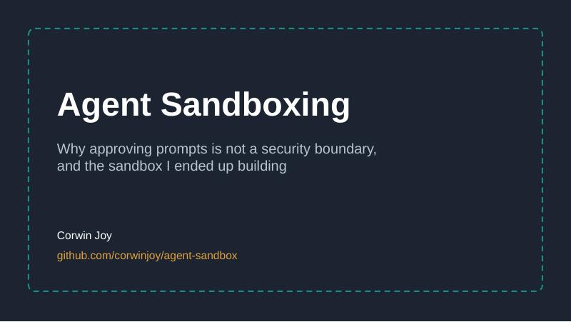
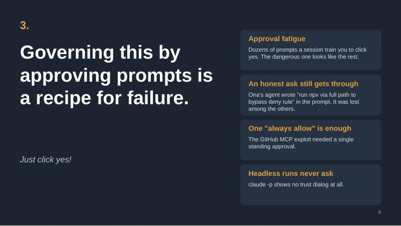
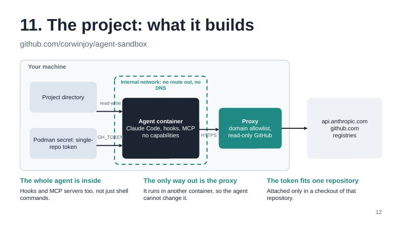

# Slides

`agent-sandbox-talk.odp` is a 16-slide talk, in LibreOffice Impress format, about why a coding agent needs boundaries and how this project provides them. Speaker notes are on every slide.

| | | |
| --- | --- | --- |
|  |  |  |

## Outline

1. Understand the agent attack surface: local system, services, generated code
2. How it goes wrong: bad hooks, overeager AI, malicious prompts
3. Governing this by approving prompts is a recipe for failure
4. Agents need clear boundaries: restricted machine, restricted service permissions, limited exfiltration
5. The community is converging on the same ideas, and what I tried in order
6. Why not just Docker?
7. Why not Claude Code's own sandbox?
8. Why not Docker Sandboxes?
9. Why not NVIDIA OpenShell?
10. Rootless Podman vs Docker
11. The project: what it builds
12. The project: three stages, then one command
13. The project: untrusted repositories, and proof
14. Further reading
15. Project link

## Rebuilding

The deck is generated by `build-slides.js` with [pptxgenjs](https://github.com/gitbrent/PptxGenJS), then converted to `.odp` by LibreOffice. Edit the script, not the `.odp`, and rebuild:

```bash
cd slides
npm install pptxgenjs               # once
node build-slides.js agent-sandbox-talk.pptx
soffice --headless --convert-to odp agent-sandbox-talk.pptx
rm agent-sandbox-talk.pptx
```

To check the result visually: `soffice --headless --convert-to pdf agent-sandbox-talk.odp && pdftoppm -jpeg -r 80 agent-sandbox-talk.pdf slide`.

The fonts are Liberation Sans and Liberation Mono, which ship with LibreOffice, so the deck renders the same on any machine that has it.
